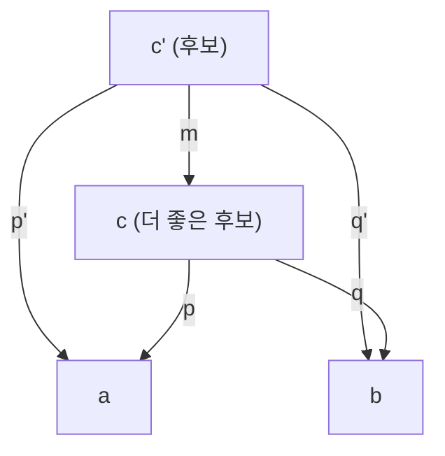
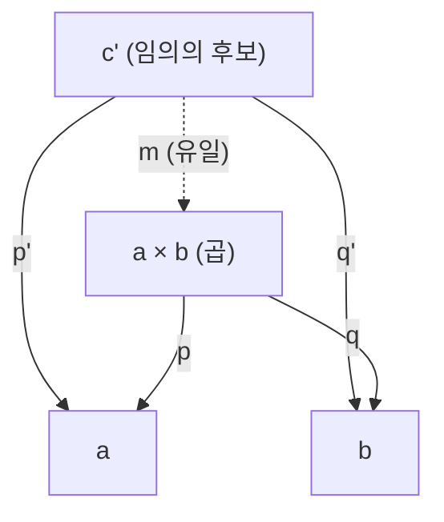
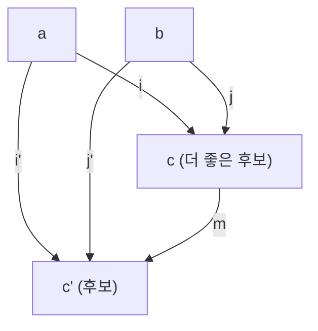
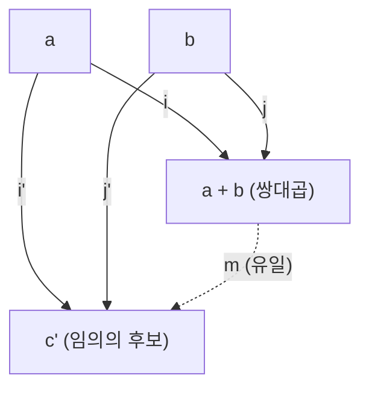

# Chapter 5: Products and Coproducts — 곱과 쌍대곱

> **핵심 개념**: 카테고리에서 특정 대상을 특징짓는 방법이 **보편적 구성(universal construction)**이다. 이 방법으로 **시작 대상**, **끝 대상**, **곱(product)**, **쌍대곱(coproduct)**을 정의한다. 화살표를 뒤집으면 쌍대 개념을 얻는 **쌍대성(duality)**도 핵심이다.

---

## 왜 보편적 구성이 필요한가

집합론에서 곱집합은 "순서쌍의 집합"으로 정의한다: `A × B = {(a, b) | a ∈ A, b ∈ B}`. 원소를 직접 꺼내서 쌍을 만드는 정의다.

그런데 카테고리에서 대상은 내부 구조가 없는 점(dot)일 뿐이다. 원소를 열어볼 수 없다. 그러면 곱(product)을 어떻게 정의할까?

답은 **관계로 특징짓는 것**이다. 대상이 뭔지 직접 볼 수 없으니, 그 대상이 다른 대상과 **어떤 화살표를 맺는지**로 정의한다. 이 방법이 **보편적 구성(universal construction)**이며, 이 장에서 곱과 쌍대곱을 정의하는 데 쓰일 뿐 아니라 이후 극한(Ch12), 수반(Ch18) 등 카테고리 이론 전반에서 반복적으로 등장하는 핵심 방법론이다.

---

## 보편적 구성 (Universal Construction)

구체적인 절차를 보자. 카테고리에서 특정 대상을 다른 대상과의 **관계 패턴**으로 특징짓는 과정은 구글 검색과 비슷하다:

1. **패턴 정의**: 대상과 사상으로 이루어진 패턴을 설정
2. **후보 검색**: 카테고리에서 이 패턴에 맞는 모든 후보를 찾음 (보통 많다)
3. **랭킹**: 후보들 사이에 순위를 매김 (사상을 이용)
4. **최적 선택**: 가장 "좋은" 후보를 선택 — 이것이 보편적 구성의 결과

이렇게 선택된 최적의 대상이 만족하는 성질을 **보편적 성질(universal property)**이라 한다. 보통 수학에서 대상을 정의할 때는 "이것은 이런 내부 구조를 가진 것이다"라고 서술하지만, 보편적 성질은 반대다. 내부 구조를 전혀 몰라도, **밖에서 다른 모든 대상과 맺는 관계**만으로 대상을 유일하게 특정한다.

그 관계의 골격은 항상 같다:

> **"모든** 대상(후보)에 대해 **유일한** 사상이 존재한다"

이 한 문장이 시작 대상, 끝 대상, 곱, 쌍대곱 등 모든 보편적 구성에 공통으로 적용되는 핵심이다. "어떤 후보가 오든(**모든**)" 예외 없이 분해할 수 있고, 그 방법이 "하나뿐(**유일**)"이라는 두 조건이 최적의 대상을 결정한다.

---

## 시작 대상 (Initial Object)

보편적 구성을 처음 적용해보자. 가장 단순한 패턴인 **대상 하나**로 시작한다.

카테고리에 대상이 잔뜩 있을 때, 그중 "가장 처음"에 해당하는 대상은 뭘까? 순서를 매기려면 기준이 필요하다. 카테고리에서 쓸 수 있는 건 화살표뿐이니까, **"a에서 b로 화살표가 있으면 a가 b보다 더 앞선다"**를 기준으로 삼자.

그러면 "가장 앞선" 대상은? **모든 대상으로 화살표를 보내는 대상**이다. 그런데 후보가 여럿이면 곤란하니까 조건을 하나 더 건다: 각 대상으로 가는 화살표가 **딱 하나**여야 한다.

> **정의**: 카테고리에서 **시작 대상(initial object)**은 모든 대상으로 가는 **유일한** 사상이 존재하는 대상이다.

Set 카테고리에서 시작 대상은 **공집합(empty set)**이다. 공집합에서 어떤 집합으로든 함수를 만들 수 있는데, 정의역에 원소가 없으므로 매핑할 게 없어서 함수가 **정확히 하나** 존재한다 (공허하게 유일). Haskell에서는 `Void` 타입과 `absurd` 함수로 표현한다:

```haskell
absurd :: Void -> a
```

시작 대상은 (존재한다면) **동형사상에 이르기까지 유일**하다 — 이 증명은 동형사상 섹션에서 다룬다.

---

## 끝 대상 (Terminal Object)

시작 대상을 뒤집어 보자. 시작 대상이 "모든 대상으로 **보내는**" 대상이었다면, 끝 대상은 "모든 대상에서 **받는**" 대상이다.

> **정의**: 카테고리에서 **끝 대상(terminal object)**은 모든 대상에서 오는 **유일한** 사상이 존재하는 대상이다.

Set 카테고리에서 끝 대상은 **단원소 집합(singleton)**, Haskell의 `()`이다. 어떤 타입이든 `()` 로 보내는 함수는 "전부 무시하고 `()`를 돌려준다" 하나뿐이다:

```haskell
unit :: a -> ()
unit _ = ()
```

**유일성이 핵심이다.** 예를 들어 `Bool`은 끝 대상이 아니다. 아무 타입에서 `Bool`로 가는 함수가 `yes _ = True`와 `no _ = False` 두 개나 있기 때문이다. "유일한 사상" 조건을 만족하지 못한다. 반면 `()`로 가는 함수는 `unit _ = ()` 딱 하나이므로 끝 대상이다.

---

## 쌍대성 (Duality)

시작 대상과 끝 대상의 정의를 나란히 놓으면, **화살표 방향만 다르다**는 걸 알 수 있다:

- 시작 대상: 모든 대상으로 **나가는** 유일한 사상
- 끝 대상: 모든 대상에서 **들어오는** 유일한 사상

이렇게 "화살표를 전부 뒤집으면 다른 개념이 나오는 것"이 **쌍대성(duality)**이다.

실제로, 어떤 카테고리 **C**의 모든 화살표를 뒤집으면 새로운 카테고리가 만들어진다. 이것을 **반대 카테고리(opposite category)** **C^op**라 한다:

```haskell
-- 원래 카테고리
f :: a -> b
g :: b -> c
h = g . f :: a -> c

-- 반대 카테고리: 화살표 방향 + 합성 순서 모두 뒤집힘
f_op :: b -> a
g_op :: c -> b
h_op = f_op . g_op :: c -> a
```

쌍대성의 강력한 점: 어떤 개념을 카테고리 C에서 정의하고 증명하면, 화살표를 뒤집은 쌍대 개념이 C^op에서 **공짜로** 성립한다. 쌍대 개념에는 접두사 **co-**를 붙인다:

- product ↔ **co**product
- monad ↔ **co**monad  
- cone ↔ **co**cone
- limit ↔ **co**limit

> 화살표를 두 번 뒤집으면 원래로 돌아오므로 (C^op)^op = C. co-co-monad 같은 것은 없다.

---

## 동형사상 (Isomorphism)

카테고리에서 두 대상이 "같다"는 걸 어떻게 말할까? 집합론의 등호(=)는 원소를 비교해야 하니까 카테고리에서는 쓸 수 없다. 대신 화살표로 "같음"을 표현한다.

사상 `f :: a → b`에 대해, 반대 방향으로 가는 `g :: b → a`가 존재하고, 둘을 합성하면 양쪽 모두 항등 사상이 되면 **동형사상(isomorphism)**이다:

```haskell
g . f = id_a    -- a에서 출발해서 b를 거쳐 다시 a로 돌아오면 아무것도 안 한 것과 같다
f . g = id_b    -- b에서 출발해도 마찬가지
```

직관적으로, 동형인 두 대상은 "같은 모양"이다. 한 대상의 각 부분이 다른 대상의 각 부분에 정보 손실 없이 1:1로 대응된다.

### 시작 대상의 유일성 증명

보편적 구성의 결과가 정말 유일한지 확인해보자. 시작 대상이 i₁, i₂ 두 개 있다고 가정한다.

**1단계 — 사상 두 개를 확보한다:**

- i₁이 시작 대상이므로 **모든 대상으로** 유일한 사상이 있다 → i₂로 가는 `f :: i₁ → i₂`가 **유일**
- i₂도 시작 대상이므로 마찬가지 → i₁로 가는 `g :: i₂ → i₁`이 **유일**

**2단계 — 합성 `g . f`를 생각한다:**

`g . f :: i₁ → i₁` — i₁에서 출발해서 i₂를 거쳐 다시 i₁으로 돌아오는 사상이다. 그런데 i₁은 시작 대상이므로, **i₁ 자기 자신으로** 가는 사상도 **딱 하나**만 존재해야 한다. 한편 `id_i₁ :: i₁ → i₁`(항등 사상)은 카테고리의 공리에 의해 반드시 존재한다. i₁에서 i₁로 가는 사상이 하나뿐인데 `id_i₁`이 이미 그 자리를 차지하고 있으므로 → `g . f = id_i₁` (다른 선택지가 없다)

여기서 핵심 트릭은 **시작 대상의 정의가 자기 자신에게도 적용된다**는 점이다. "**모든** 대상으로 유일한 사상"에서 "모든"에는 자기 자신도 포함된다.

**3단계 — 반대 방향도 동일하다:**

같은 논리를 i₂에 적용한다. `f . g :: i₂ → i₂`인데, i₂도 시작 대상이라 i₂에서 i₂로 가는 사상은 `id_i₂` 하나뿐이므로 → `f . g = id_i₂`

**4단계 — 동형사상의 정의를 충족한다:**

`g . f = id_i₁`이고 `f . g = id_i₂`이므로, f와 g는 동형사상이다. 따라서 i₁ ≅ i₂.

만약 "유일한"이라는 조건이 없었다면 `g . f`가 `id`와 다른 사상일 가능성이 열려서 이 증명은 성립하지 않는다. **유일성이 동형을 강제**하는 것이다. 사상이 유일하기 때문에 동형사상도 유일하다. 이 "유일한 동형에 이르는 유일성(uniqueness up to unique isomorphism)"은 모든 보편적 구성이 공유하는 핵심 성질이다.

---

## 곱 (Product)

집합론에서 곱집합(Cartesian product)은 순서쌍의 집합이다. 이것을 카테고리 언어로 번역하려면, 쌍(pair)을 원소 없이 표현해야 한다.

쌍 `(a, b)`의 본질은 뭘까? 쌍에서 할 수 있는 건 **첫째 원소를 꺼내기**와 **둘째 원소를 꺼내기**뿐이다. 이 "꺼내기"를 **투영(projection)**이라 한다:

```haskell
fst :: (a, b) -> a
fst (x, _) = x

snd :: (a, b) -> b
snd (_, y) = y
```

이 두 화살표가 곱을 특징짓는 **패턴**이다.

### 보편적 구성으로 곱 정의하기

보편적 구성의 4단계를 적용해보자.

**1. 패턴**: 대상 c에서 a, b 각각으로 가는 두 사상 `p :: c → a`, `q :: c → b`

**2. 후보 검색**: 이 패턴을 만족하는 c는 많다. `Int`와 `Bool`의 곱을 찾는다고 하면:

```haskell
-- 후보 1: Int — 정보가 부족
p :: Int -> Int
p x = x
q :: Int -> Bool
q _ = True          -- Bool 정보를 잃어버림 (아무 값이나 찍음)

-- 후보 2: (Int, Int, Bool) — 정보가 과다
p :: (Int, Int, Bool) -> Int
p (x, _, _) = x
q :: (Int, Int, Bool) -> Bool
q (_, _, b) = b     -- 두 번째 Int는 불필요한 잉여 정보
```

후보 1은 Bool 정보를 담지 못하고, 후보 2는 쓸데없는 정보를 들고 있다. **딱 필요한 만큼만** 담는 대상이 최적이다.

**3. 랭킹**: 후보 c'가 c보다 "못하다"는 것은, `m :: c' → c`가 존재하여 c'의 투영이 c의 투영을 거쳐 분해(factorize)될 수 있다는 뜻이다:



c'에서 a, b로 가는 경로가 두 가지다:
- **직접**: c' --p'→ a, c' --q'→ b
- **c 경유**: c' --m→ c --p→ a, c' --m→ c --q→ b

이 두 경로가 같으면(`p' = p . m`, `q' = q . m`), c가 c'보다 더 좋은 후보다.

구체적으로 보자. 위 예시에서 후보 2인 `(Int, Int, Bool)`과 곱인 `(Int, Bool)`을 비교하면:

```haskell
-- m은 잉여 정보(두 번째 Int)를 버리는 사상
m :: (Int, Int, Bool) -> (Int, Bool)
m (x, _, b) = (x, b)

-- 후보 2에서 직접 꺼내기
p' (x, _, b) = x       -- == p (x, b) == p (m (x, _, b))  ✓  p' = p . m
q' (x, _, b) = b       -- == q (x, b) == q (m (x, _, b))  ✓  q' = q . m
```

m으로 잉여 정보를 버려도 투영 결과가 똑같다는 건, 그 정보가 애초에 **불필요**했다는 뜻이다. 즉 `(Int, Bool)`이 `(Int, Int, Bool)`보다 군더더기 없이 a, b에 대한 정보를 담고 있으므로 더 좋은 후보다.

반대로 후보 1(`Int`)은 Bool 정보를 잃어버렸기 때문에, `Int`에서 `(Int, Bool)`로 가는 사상 m을 만들 수 없다 — Bool 값을 복원할 방법이 없기 때문이다.

결국 곱 `(Int, Bool)`은 정보 과다한 후보는 m으로 압축할 수 있고, 정보 부족한 후보로는 m을 만들 수 없어서, **딱 필요한 만큼만** 담는 최적의 대상이다.

**4. 최적 선택**: 다른 모든 후보 c'에 대해, c'에서 c로의 **유일한** 사상 m이 항상 존재하는 대상. 이것이 곱이다.



이 다이어그램에서 점선 화살표 m이 핵심이다. **어떤** 후보 c'가 오더라도 `p' = p . m`, `q' = q . m`을 만족하는 m이 **반드시 하나** 존재한다. 이것이 곱의 **보편적 성질(universal property)**이다.

이 다이어그램에서 a×b가 곱이다. **어떤** 후보 c'가 오더라도, c'에서 a×b로 가는 사상 m이 **반드시 하나** 존재하여 모든 투영을 분해한다. 이것이 곱의 **보편적 성질(universal property)**이다.

> **곱의 정의**: 두 대상 a, b의 곱은 투영 p, q를 갖춘 대상 c로, 임의의 다른 후보 c'에 대해 그것의 투영을 분해하는 **유일한 사상** m이 존재한다.

이 유일한 사상 m을 만들어주는 고차 함수를 **factorizer**라 부른다:

```haskell
factorizer :: (c -> a) -> (c -> b) -> (c -> (a, b))
factorizer p q = \x -> (p x, q x)
```

두 투영 p, q를 넣으면 곱으로의 유일한 사상이 나온다.

---

## 쌍대곱 (Coproduct)

곱의 **쌍대**: 화살표를 전부 뒤집는다.

곱에서는 c **에서** a, b로 **나가는** 투영(projection)이 패턴이었다. 화살표를 뒤집으면 a, b **에서** c로 **들어오는** 사상이 된다. 이것을 **주입(injection)**이라 한다:

```haskell
i :: a -> c     -- a를 c 안에 넣기
j :: b -> c     -- b를 c 안에 넣기
```

곱이 "꺼내기(투영)"로 특징지어졌다면, 쌍대곱은 **"넣기(주입)"**로 특징지어진다.

### 보편적 구성으로 쌍대곱 정의하기

곱에서 했던 4단계를 화살표만 뒤집어서 다시 적용해보자.

**1. 패턴**: a, b 각각에서 대상 c로 들어오는 두 사상 `i :: a → c`, `j :: b → c`

**2. 후보 검색**: 이 패턴을 만족하는 c는 많다. `Int`와 `Bool`의 쌍대곱을 찾는다고 하면:

```haskell
-- 후보 1: Int — 정보가 손실됨
i :: Int -> Int
i x = x
j :: Bool -> Int
j b = if b then 1 else 0   -- Bool을 Int로 변환하면서 원래 뭐였는지 구분 불가능

-- 후보 2: (Int, Bool, Int) — 정보가 과다
i :: Int -> (Int, Bool, Int)
i x = (x, False, 0)        -- 쓸데없는 잉여 필드까지 채워야 함
j :: Bool -> (Int, Bool, Int)
j b = (0, b, 0)
```

후보 1은 Int와 Bool을 섞어버려서 **어디서 왔는지** 구분할 수 없고, 후보 2는 불필요한 정보를 끌고 다닌다.

**3. 랭킹**: 곱에서는 "후보 c'에서 c로" 가는 m이었다. 쌍대곱에서는 화살표가 뒤집히므로 **"c에서 c'로"** 가는 `m :: c → c'`가 존재하여 주입을 분해할 수 있으면, c가 c'보다 더 좋은 후보다:



```haskell
i' = m . i      -- a에서 c'로 직접 가기 = c를 경유해서 가기
j' = m . j      -- b에서 c'로 직접 가기 = c를 경유해서 가기
```

곱과 비교하면 화살표 방향이 정반대다. 곱에서는 c'→c 방향이었지만, 쌍대곱에서는 c→c' 방향이다.

구체적으로 보자. 쌍대곱 `Either Int Bool`과 후보 1(`Int`)을 비교하면:

```haskell
-- m은 Either의 각 케이스를 처리하여 Int로 변환
m :: Either Int Bool -> Int
m (Left x)  = x
m (Right b) = if b then 1 else 0

-- Either에 넣은 뒤 m을 적용하면 후보 1의 주입과 같다
i' x = m (Left x)  = x                        -- ✓  i' = m . i
j' b = m (Right b) = if b then 1 else 0        -- ✓  j' = m . j
```

m이 하는 일은 `Either`의 구분 정보를 **버리고 합치는 것**이다. 합칠 수 있다는 건 후보 1이 Either보다 정보가 적다는 뜻이다.

반대로 `Int`에서 `Either Int Bool`로 가는 사상은 만들 수 없다 — Int 값 `1`을 받았을 때 이것이 원래 `Left 1`이었는지 `Right True`였는지 **복원할 방법이 없기** 때문이다.

**4. 최적 선택**: 다른 모든 후보 c'에 대해, c에서 c'로의 **유일한** 사상 m이 항상 존재하는 대상. 이것이 쌍대곱이다.



> **쌍대곱의 정의**: 두 대상 a, b의 쌍대곱은 주입 i, j를 갖춘 대상 c로, 임의의 다른 후보 c'에 대해 **유일한** `m :: c → c'`가 존재하여 c의 주입을 분해한다.

### Set 카테고리에서의 쌍대곱

Set 카테고리에서 쌍대곱은 **분리 합집합(disjoint union)**이다. 두 집합의 원소를 섞이지 않게 한데 모은 것. Haskell의 `Either`, Swift의 enum으로 구현된다:

```haskell
data Either a b = Left a | Right b
```

```swift
enum Either<A, B> {
    case left(A)
    case right(B)
}
```

`Left`와 `Right`가 각각 주입 함수 역할을 한다. a 타입의 값을 `Left`로 감싸면 `Either` 안에 "넣는" 것이다.

### 쌍대곱의 factorizer

곱의 factorizer가 두 투영 `p`, `q`를 받아서 곱으로의 사상을 만들었다면, 쌍대곱의 factorizer는 두 함수 `i`, `j`를 받아서 쌍대곱에서 나가는 사상을 만든다:

```haskell
factorizer :: (a -> c) -> (b -> c) -> Either a b -> c
factorizer i j (Left a)  = i a
factorizer i j (Right b) = j b
```

`i`와 `j`만 주어지면 m이 **자동으로 유일하게** 결정된다. `Left`이면 `i`를 적용하고, `Right`이면 `j`를 적용하는 것 외에 다른 선택지가 없기 때문이다.

---

## 비대칭성 (Asymmetry)

카테고리 정의에서 곱과 쌍대곱은 화살표 방향만 다른 완벽한 거울상이다. 그런데 Set 카테고리에서 실제 구현을 보면 전혀 다르게 생겼다:

| 개념 | 패턴 | Set에서의 구현 | 산술 비유 |
|------|------|---------------|-----------|
| 시작 대상 | 모든 곳으로 보냄 | 공집합 `Void` | 0 |
| 끝 대상 | 모든 곳에서 받음 | 단원소 집합 `()` | 1 |
| 쌍대곱 | 주입(넣기) | `Either a b` | 덧셈 |
| 곱 | 투영(꺼내기) | `(a, b)` | 곱셈 |

추상적 수준에서는 화살표 방향만 뒤집으면 되는데, 왜 구현은 이렇게 다를까?

### 함수 자체가 비대칭적이다

Set 카테고리의 화살표인 **함수**는 입력과 출력에 대한 규칙이 다르다:

```haskell
f :: A -> B
```

- **입력(정의역) 쪽**: 모든 원소에 대해 **반드시** 결과가 정의되어야 한다. 빠뜨리면 함수가 아니다.
- **출력(공역) 쪽**: 전부 쓸 필요 없다. `f :: Int -> Int`에서 `f x = 1`이면 공역의 대부분이 안 쓰이지만 괜찮다.
- **합치기**: 입력의 여러 원소가 출력의 같은 원소로 갈 수 있다. `f 1 = 0`, `f 2 = 0`처럼.

이것을 구체적인 예시로 보자:

```haskell
-- 정의역 A = {1, 2, 3}, 공역 B = {x, y, z}

-- 가능: 모든 입력이 매핑됨, 출력은 일부만 사용
f 1 = x
f 2 = x
f 3 = y     -- z는 안 쓰여도 됨, 1과 2가 같은 곳으로 가도 됨

-- 불가능: 입력 3에 대한 매핑이 없음 → 함수가 아님
g 1 = x
g 2 = y
-- g 3 = ???
```

### 이 비대칭이 구현을 바꾼다

**곱 `(a, b)` — 꺼내기(투영)**

```haskell
fst :: (a, b) -> a
fst (x, _) = x     -- 모든 입력 (x, _)에 대해 정의됨 ✓
```

쌍 안에 두 값이 **항상 같이 들어있으므로** 어느 쪽이든 꺼낼 수 있다. 정보를 무시할 수는 있어도(fst는 b를 버린다), 없는 정보를 만들어낼 필요는 없다.

**쌍대곱 `Either a b` — 넣기(주입)**

```haskell
Left  :: a -> Either a b
Right :: b -> Either a b
```

한 번에 **하나만** 넣을 수 있다. `Left 3`에는 b 값이 없고, `Right True`에는 a 값이 없다. 그래서 쌍대곱을 **사용**할 때는 반드시 패턴 매칭으로 경우를 나눠야 한다:

```haskell
handle :: Either Int Bool -> String
handle (Left n)  = show n       -- Int인 경우
handle (Right b) = show b       -- Bool인 경우
```

곱은 "두 값이 동시에 있다" → 구조체/튜플처럼 생겼고, 쌍대곱은 "두 값 중 하나만 있다" → enum/tagged union처럼 생겼다. 카테고리 수준에서는 거울상이지만, 함수의 입출력 비대칭 때문에 **구현이 완전히 달라지는 것**이다.

### 산술과의 대응

이 비대칭은 산술과도 깔끔하게 대응된다:

- `Void`(공집합, 원소 0개) ↔ **0**: 어떤 것과 곱해도(`(Void, a)`) 값을 만들 수 없다 → `0 × a = 0`
- `()`(단원소, 원소 1개) ↔ **1**: 곱해도 정보가 추가되지 않는다(`((), a) ≅ a`) → `1 × a = a`
- `Either a b`(분리 합집합) ↔ **덧셈**: 원소 수가 더해진다(`|Either a b| = |a| + |b|`)
- `(a, b)`(곱집합) ↔ **곱셈**: 원소 수가 곱해진다(`|(a, b)| = |a| × |b|`)

예를 들어 `Bool`은 원소가 2개이므로 `Either () ()` ≅ `Bool`이다 — `1 + 1 = 2`. `(Bool, Bool)`은 원소가 4개 — `2 × 2 = 4`. 이 대응이 다음 장(Ch6)에서 대수적 데이터 타입(ADT)의 기초가 된다.

---

## 정리

- **보편적 구성**: 패턴 정의 → 후보 검색 → 랭킹 → 최적 선택
- **시작 대상**: 모든 대상으로 가는 유일한 사상이 있는 대상 (Set에서 `Void`)
- **끝 대상**: 모든 대상에서 오는 유일한 사상이 있는 대상 (Set에서 `()`)
- **쌍대성**: 화살표를 뒤집으면 쌍대 개념을 얻는다 (co- 접두사)
- **동형사상**: 역사상이 있는 사상. 보편적 구성의 결과는 동형에 이르기까지 유일
- **곱**: 두 투영을 갖춘 대상의 보편적 구성 (Set에서 쌍 `(a, b)`)
- **쌍대곱**: 두 주입을 갖춘 대상의 보편적 구성 (Set에서 `Either a b`)
- **factorizer**: 보편적 구성에서 유일한 사상 m을 만들어내는 고차 함수
