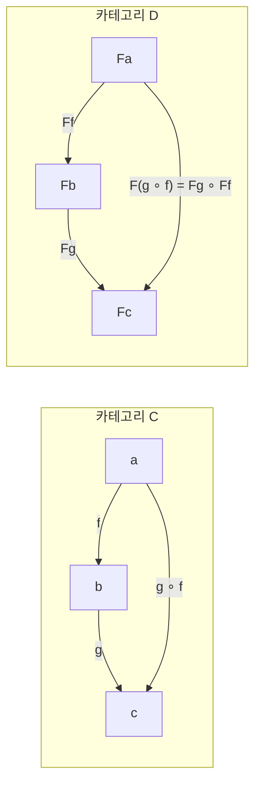

# Chapter 7: Functors — 펑터

> **핵심 개념**: **펑터(Functor)**는 카테고리 사이의 구조를 보존하는 매핑이다. 대상을 대상으로, 사상을 사상으로 매핑하되, 합성과 항등 사상을 보존한다. 프로그래밍에서 펑터는 **타입 생성자 + fmap**으로 구현되며, Maybe, List, Reader 등 다양한 예시가 있다.

---

## 왜 펑터가 필요한가

지금까지 카테고리 **안에서** 대상과 사상의 관계를 다뤘다. 그런데 카테고리 **사이의** 관계는 어떻게 표현할까?

예를 들어 프로그래밍에서 `Int`에 `Maybe`를 씌우면 `Maybe Int`가 된다. 그리고 `Int → String` 함수가 있으면, `Maybe Int → Maybe String` 함수도 자연스럽게 만들 수 있다. 이렇게 **타입도 옮기고, 함수도 함께 옮기되, 원래의 합성 관계를 깨뜨리지 않는 매핑** — 이것이 펑터다.

---

## 펑터의 정의 (카테고리 일반)

두 카테고리 **C**와 **D**가 있을 때, 펑터 F: C → D는 다음을 만족하는 매핑이다:

1. **대상의 매핑**: C의 대상 a를 D의 대상 Fa로 보낸다
2. **사상의 매핑**: C의 사상 `f :: a → b`를 D의 사상 `Ff :: Fa → Fb`로 보낸다
3. **합성 보존**: `F(g ∘ f) = Fg ∘ Ff`
4. **항등 보존**: `F(id_a) = id_{Fa}`



직관적으로, 펑터는 카테고리의 **구조를 보존하면서** 다른 카테고리로 옮기는 것이다. 원래 카테고리에서 연결된 것은 옮긴 후에도 여전히 연결되어 있다. 조건 3(합성 보존)과 4(항등 보존)가 이 "구조 보존"을 보장한다.

- **합성 보존**: C에서 `f` 다음 `g`를 했을 때의 결과를 옮긴 것과, 옮긴 후 `Ff` 다음 `Fg`를 한 것이 같다. 순서를 바꿔도 결과가 같으므로 구조가 깨지지 않는다.
- **항등 보존**: "아무것도 안 하기"를 옮기면 옮긴 쪽에서도 "아무것도 안 하기"가 된다. 없던 변환이 생기지 않는다.

### 특수한 펑터들

- **자기 함자(Endofunctor)**: 출발과 도착 카테고리가 **같은** 펑터 (F: C → C). 프로그래밍에서 다루는 펑터는 대부분 이것이다 — 타입의 카테고리에서 타입의 카테고리로 매핑하므로.
- **상수 펑터(Constant Functor)** Δ_c: 모든 대상을 하나의 대상 c로, 모든 사상을 id_c로 매핑한다. 모든 구조를 한 점으로 압축하는 것인데, 이래도 펑터 법칙은 성립한다 — `id_c ∘ id_c = id_c`이므로 합성이 보존되고, 항등 사상도 id_c로 보내니 항등 보존도 만족한다. 나중에 Const 펑터로 다시 나온다.

---

## 프로그래밍에서의 펑터 (Set 카테고리)

위의 정의는 카테고리 일반의 추상적 정의다. 이것을 Set 카테고리(= 프로그래밍의 타입 세계)에 적용하면:

| 카테고리 일반 | Set/프로그래밍 |
|-------------|--------------|
| 대상의 매핑 (a ↦ Fa) | **타입 생성자**: `Maybe`, `[]`, `(->) r` 등. 타입을 넣으면 새 타입이 나온다 |
| 사상의 매핑 (f ↦ Ff) | **fmap**: 함수를 넣으면 "포장된" 함수가 나온다 |
| 합성 보존 | `fmap (g . f) = fmap g . fmap f` |
| 항등 보존 | `fmap id = id` |

프로그래밍의 펑터는 출발과 도착이 같은 카테고리(타입의 카테고리)이므로, 모두 **자기 함자(endofunctor)**이다.

### Maybe 펑터

```haskell
data Maybe a = Nothing | Just a

-- fmap: 함수를 Maybe 안의 값에 적용
fmap :: (a -> b) -> Maybe a -> Maybe b
fmap _ Nothing  = Nothing
fmap f (Just x) = Just (f x)
```

`fmap`은 함수를 **리프팅(lifting)**한다고도 말한다: 일반 함수 `a → b`를 Maybe 세계의 함수 `Maybe a → Maybe b`로 끌어올린다. 원래 함수는 "값이 항상 있다"는 전제로 동작하지만, fmap을 통해 "값이 없을 수도 있는 세계"에서도 안전하게 동작하게 된다.

```swift
enum Optional<T> {
    case nothing
    case just(T)
    
    func fmap<B>(_ f: (T) -> B) -> Optional<B> {
        switch self {
        case .nothing: return .nothing
        case .just(let x): return .just(f(x))
        }
    }
}
```

### 펑터 법칙의 증명 (Equational Reasoning)

Haskell의 함수는 등식으로 정의되므로, 양변을 치환하여 증명할 수 있다:

**항등 법칙** `fmap id = id`:

```haskell
-- Nothing 케이스
fmap id Nothing
  = Nothing           -- fmap 정의
  = id Nothing        -- id 정의

-- Just 케이스
fmap id (Just x)
  = Just (id x)       -- fmap 정의
  = Just x            -- id 정의
  = id (Just x)       -- id 정의
```

**합성 법칙** `fmap (g . f) = fmap g . fmap f`:

```haskell
-- Nothing 케이스
fmap (g . f) Nothing = Nothing = fmap g (fmap f Nothing)

-- Just 케이스
fmap (g . f) (Just x)
  = Just ((g . f) x)           -- fmap 정의
  = Just (g (f x))             -- 합성 정의
  = fmap g (Just (f x))        -- fmap 정의 역적용
  = fmap g (fmap f (Just x))   -- fmap 정의 역적용
  = (fmap g . fmap f) (Just x) -- 합성 정의
```

---

### List 펑터

```haskell
data List a = Nil | Cons a (List a)

instance Functor List where
    fmap _ Nil        = Nil
    fmap f (Cons x t) = Cons (f x) (fmap f t)
```

`fmap f`는 리스트의 각 원소에 `f`를 적용한다. 재귀적으로 정의되며, Nil에 도달하면 종료된다.

### Reader 펑터

타입 `a`를 `r → a` (r에서 a로의 함수)로 매핑하는 펑터. 타입 생성자는 `(->) r`이다.

`Maybe`가 타입을 감싸서 새 타입을 만들듯이, `(->) r`도 타입을 받아서 새 타입을 만든다:

```haskell
Maybe   :: Int  →  Maybe Int        -- Int를 Maybe로 감싼다
(->) r  :: Int  →  (r -> Int)       -- Int를 "r에서 Int를 만드는 함수"로 바꾼다
```

그러면 fmap은? Maybe의 fmap이 "상자 안의 값에 함수를 적용"이었다면, Reader의 fmap은 **"함수의 출력에 함수를 적용"**이다:

```haskell
-- Maybe: 상자 안의 값을 변환
fmap show (Just 3)   = Just "3"

-- Reader: 함수의 출력을 변환
fmap show getPort    = show . getPort
-- getPort :: Config -> Int 의 출력에 show를 적용
-- 결과: Config -> String
```

fmap의 타입을 보면:

```haskell
fmap :: (a -> b) -> (r -> a) -> (r -> b)
```

`r → a` 함수의 출력 `a`에 `a → b`를 적용하여 `r → b`를 만든다. 이것은 그냥 **함수 합성**이다:

```haskell
instance Functor ((->) r) where
    fmap f g = f . g
    -- = \x -> f (g x)
    -- g로 먼저 값을 만들고, f로 그 값을 변환
    -- 즉, fmap = (.)  (함수 합성 그 자체!)
```

구체적인 예시:

```haskell
getPort :: Config -> Int           -- r -> a  (설정에서 포트를 꺼냄)
show    :: Int -> String           -- a -> b  (숫자를 문자열로)

fmap show getPort :: Config -> String   -- r -> b
-- = show . getPort
-- = \config -> show (getPort config)
```

> Maybe는 "상자 안의 값"을 변환하고, Reader는 "함수의 결과"를 변환한다. 둘 다 "안에 있는 것에 함수를 적용한다"는 같은 패턴이고, 그래서 둘 다 펑터다. Reader는 상자가 아니라 **함수 자체**가 펑터라는 점에서, 펑터가 단순한 "컨테이너"를 넘어서는 개념임을 보여준다.

---

## 펑터와 컨테이너

Maybe나 List처럼 값을 담고 있는 컨테이너는 펑터의 직관적 예시다. 하지만 Reader 펑터처럼 함수 자체가 펑터가 될 수도 있다.

Haskell에서는 게으른 평가(lazy evaluation) 덕분에 데이터와 코드의 경계가 모호하다:

```haskell
nats :: [Integer]
nats = [1..]  -- 무한한 자연수 리스트 (실제로는 요청 시 생성하는 함수)
```

펑터의 핵심은 **값에 접근하는 것이 아니라, 값을 변환하는 것**이다. fmap은:
- 값이 있으면 변환 후 접근 가능
- 값이 없어도 변환은 올바르게 합성되어야 함
- 항등 변환은 아무 변화도 일으키지 않아야 함

### Const 펑터

극단적인 예시: 타입 인자를 완전히 무시하는 펑터.

```haskell
data Const c a = Const c

instance Functor (Const c) where
    fmap _ (Const v) = Const v
```

`Const c a`는 c 타입의 값만 저장하고 a는 실제로 쓰이지 않는 **유령 타입(phantom type)**이다. fmap에 어떤 함수를 넣든 저장된 c 값은 변하지 않는다.

```haskell
-- 예: Const String a
x :: Const String Int
x = Const "hello"

fmap (+1) x    -- = Const "hello"  (Int→Int 함수가 무시됨)
fmap show x    -- = Const "hello"  (Int→String 함수도 무시됨)
```

"아무것도 안 하는 펑터가 왜 유용한가?"라고 생각할 수 있다. 이것은 앞서 본 상수 펑터 Δ_c의 Haskell 구현이다.

실용적인 예시로 **렌즈(Lens)**가 있다. 렌즈는 "구조체의 특정 필드에 접근하는 도구"인데, getter와 setter를 하나의 함수로 표현한다:

```haskell
type Lens s a = forall f. Functor f => (a -> f a) -> s -> f s
-- s: 전체 구조 (예: Person)
-- a: 특정 필드 (예: String = name)
-- f: 어떤 펑터든 받을 수 있다
```

이 함수에 넣는 펑터 `f`에 따라 동작이 달라진다:
- `f = Const a` → fmap이 아무것도 안 하므로, 필드 값만 꺼냄 → **getter**
- `f = Identity` → fmap이 변환을 실행하므로, 필드를 바꾼 새 구조체가 나옴 → **setter**

Const의 "함수를 무시한다"는 성질 덕분에, 같은 렌즈 코드 하나로 getter와 setter를 모두 표현할 수 있다. Const 펑터의 활용은 Yoneda 보조정리(Ch15) 등에서 더 본격적으로 다룬다.

---

## 펑터의 합성

두 펑터를 합성하면 새로운 펑터가 된다. 대상 매핑과 사상 매핑을 각각 합성하면 되고, 합성/항등 보존도 자동으로 만족된다.

```haskell
-- Maybe와 List 펑터의 합성: Maybe [a]
mis :: Maybe [Int]
mis = Just [1, 2, 3]

-- 내부의 각 정수를 제곱하려면 fmap을 두 번 적용
mis2 = fmap (fmap square) mis
-- = Just [1, 4, 9]

-- 이것은 fmap의 합성과 같다
mis2 = (fmap . fmap) square mis
```

바깥쪽 `fmap`은 Maybe 인스턴스를, 안쪽 `fmap`은 List 인스턴스를 사용한다.

### Functor 타입 클래스

Haskell은 **타입 클래스(typeclass)**로 펑터 인터페이스를 추상화한다:

```haskell
class Functor f where
    fmap :: (a -> b) -> f a -> f b
```

여기서 `f`는 타입이 아니라 **타입 생성자**다 (종류가 `* -> *`). 구체적인 펑터는 인스턴스를 선언하여 fmap을 구현한다:

```haskell
instance Functor Maybe where
    fmap _ Nothing  = Nothing
    fmap f (Just x) = Just (f x)
```

### 카테고리들의 카테고리 (Cat)

펑터는 합성이 가능하고 결합법칙을 만족하며, 항등 펑터(모든 것을 그대로 두는 펑터)도 존재한다. Ch1에서 배운 카테고리의 조건 — 합성 가능, 결합법칙, 항등 — 을 모두 만족하므로, **대상이 카테고리이고 사상이 펑터인 카테고리**를 만들 수 있다. 이를 **Cat**(작은 카테고리들의 카테고리)이라 부른다.

```
Ch1의 카테고리:  대상 = 점,      사상 = 화살표,  합성 = 화살표 합성
Set 카테고리:    대상 = 집합,     사상 = 함수,    합성 = 함수 합성
Cat 카테고리:    대상 = 카테고리,  사상 = 펑터,    합성 = 펑터 합성
```

카테고리 이론은 이렇게 **같은 패턴이 다른 수준에서 반복**되는 구조를 가진다.

---

## 정리

- **펑터**: 카테고리 간의 구조 보존 매핑 (대상→대상, 사상→사상, 합성/항등 보존)
- **프로그래밍에서**: 타입 생성자(대상 매핑) + fmap(사상 매핑)
- **펑터 법칙**: `fmap id = id`, `fmap (g . f) = fmap g . fmap f`
- **Maybe 펑터**: Nothing은 그대로, Just 안의 값에 함수 적용
- **List 펑터**: 각 원소에 함수를 적용 (map)
- **Reader 펑터** `(->) r`: fmap = 함수 합성 `(.)`
- **Const 펑터**: 타입 인자를 무시하는 극단적 펑터
- **펑터 합성**: `(fmap . fmap)` — 중첩된 펑터의 내부까지 함수를 전달
- **Cat**: 카테고리들의 카테고리. 대상=카테고리, 사상=펑터
