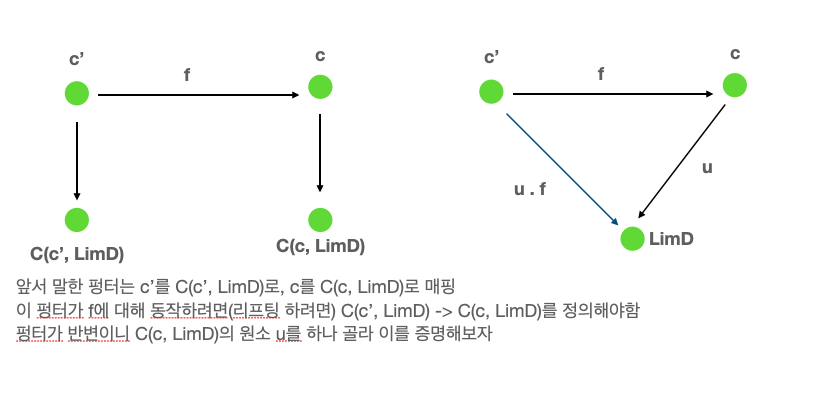
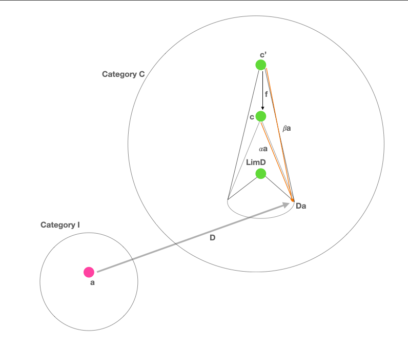

## 12. Limits and Colimits

카테고리 이론에 따라 모든것은 연결되어있고 모든것은 여러 시각에서 해석될 수 있습니다. product의 universal construction을 예로 생각해 봅시다. 이제 우리는 펑터도 알고 자연변환도 압니다. 이를 이용하여 단순화하거나 일반화 해 봅시다.

product를 만드는 방식은 두개의 대상 a, b를 선택하는 것으로부터 시작합니다. 그러면 이 선택의 의미는 무엇입니까? 이를 좀더 범주적인 의미로 재해석해 봅시다. 두 대상은 아주 단순한 패턴을 지닙니다. 우리는 이 패턴을 카테고리로 추상화 할 수 있습니다, 아주 단순한 카테고리로요. 이는 두개의 대상만 지닌 카테고리고 두 대상간 사상은 없습니다.(항등사상은 존재) 이를 카테고리 2라 부릅시다. 이제 카테고리 C에서 두가지 대상을 선택하는것을 카테고리 2에서 카테고리 C로의 펑터 D로 정의할 수 있습니다. 이 펑터는 대상을 대상으로 매핑합니다.(두개가 하나의 대상으로 매핑될수도 있습니다.) 펑터는 사상도 매핑하고 이경우에는 오직 단위사상만 매핑합니다.

이방법은 매우 범주적인 개념을 기반으로 하기 때문에 좋습니다. 수렴채집에서 가져온 어휘같은 "선택하기"로 인한 언어로 인한 오해를 제거할 수 있습니다. 또한 카테고리 2에서 이 패턴을 정의하여 더 복잡한 카테고리로 일반화 하는것도 쉽습니다.


계속해서 product의 정의의 다음 단계는 후보 객체 c를 선택하는 것 입니다. 다시 이 선택이라는 용어를 싱글톤 카테고리의 펑터로 재해석 할 수 있습니다. 만일 칸 확대(Kan extension)을 이용할 수 있다면 그것은 올바른 방법일겁니다. 하지만 우리는 아직 칸 확대를 배울 준비가 안되어있기에 다른 속임수를 이용해 봅시다. 카테고리 2에서 C로의 constant functor Δ를 이용합시다. 카테고리 C에서 c를 선택하는것은 Δ𝑐로 나태냅니다. Δ𝑐가 모든 대상을 c로 매핑하고 모든 사상을 idc로 매핑한다는 점을 기억하세요.


이제 카테고리 2에서 C로 가는 두개의 펑터 Δ𝑐, D가 있기에 두 펑터간의 자연변환을 고려하는것은 매우 자연스럽습니다. 카테고리 2에는 대상 2개가 전부이므로(대상간 사상이 없으므로) 자연변환의 컴포넌트는 2개가 존재합니다. 카테고리 2의 대상 1, 2는 Δ𝑐 펑터로 인해 카테고리 C의 c로 매핑되고 1은 D 펑터에 의해 a로 매핑됩니다. 대상 1에대한 펑터 Δ𝑐, D의 자연변환 요소는 c에서 a로 향하는 사상입니다. 이를 p라 부릅시다. 비슷하게 c에서 b로 가는 사상은 q로 부릅시다. 이와같은 두개의 투영(projection)은 원래 우리가 정의했던 product와 매우 비슷합니다. 그러기에 이제 선택이나 투영이라는 단어 대신에 펑터와 자연변환이라는 용어를 이용합시다. 이와같이 간단한 카테고리 2에서는 사상이 없기떄문에(항등사상 제외) 자연변환을 위한 naturality condition이 쉽게 만족됩니다.


이 구조를 카테고리 2를 넘어 일반화 해봅시다. 예를들어 사상이 존재하고 이를 Δ𝑐와 𝐷사이에 naturality condition을 부과하여 봅시다. 위와 같은 변환을 콘(cone)이라 부릅니다. Δ의 이미지가 원뿔/피라미드의 정점이기 때문입니다. 측면은 자연변환의 구성요소를 형성하고, D의 이미지는 원뿔의 밑변을 형성합니다.

일반적으로 콘을 만들기 위하여 패턴을 정의하는 카테고리 I로 시작합시다. 이것은 small이고 유한한 카테고리 입니다. 카테고리 I에서 C까지 펑터 D를 선택하고 이를(또는 그 이미지)를 다이어그램이라 부릅니다. 카테고리 C에서 특정 c를 콘의 정점으로 선택하고 I에서 C까지 constant functor Δ𝑐를 정의하는데 사용합니다. Δ𝑐에서 D로의 자연변환은 콘 입니다. 이는 유한한 I의 경우 c를 다이어 그램에 연결하는 사상의 묶음입니다: the image of I under D


Naturality는 이 다이어그램에 존재하는(피라미드의 면) 모든 삼각형이 commute하기를 요구합니다. 이번에는 I에서 아무 사상 f를 선택해보세요. 펑터 D는 그것을 카테고리 C의 사상 Df로 매핑합니다. constant functor Δ𝑐는 f를 c의 항등사상으로 매핑합니다. Δ는 사상의 두 끝을 하나의 대상으로 압축하고 naturality square은 commuting triangle이 됩니다. 이 삼각형의 두 변은 자연변환의 요소입니다.


이것은 원뿔 하나입니다. product를 정의할때 보편적인 대상을 선택했던것처럼 우리가 관심있는것은 보편적인 콘 입니다.

그것에는 많은 방법이 있습니다. 예를들어 주어진 펑터 D를 기준으로 콘의 범주를 정의할 수 있습니다. 이 카테고리에서 대상은 콘 입니다. Δ𝑐 와 𝐷 사이에 자연변환이 존재하지 않을 수 있기 때문에 C에 속하는 모든 대상 c가 콘의 정점이 될수는 없습니다.

이것을 카테고리로 만들기 위하여 콘 사이의 사상을 정의하여하고 이는 콘의 정점사이의 사상에 의해 완전히 결정됩니다. 하지만 모든 사상이 다 해당하는것은 아닙니다?(But not just any morphism will do.) product의 구조를 생각해보세요, 우리는 두 후보군(콘) 사이에 있는 사상에 투영을 위한 공통 요소(인수분해의 최대공약수처럼)이여하 한다는 조건을 부여했었습니다.

```haskell
p' = p . m
q' = q . m
```


이 조건을 일반적인 케이스에서 다음과 같이 해석됩니다. factorizing한 한쪽에 해당하는 삼각형은 모든 사상이 commute 합니다?(the triangles whose one side is the factorizing morphism all commute.)


(The commuting triangle connecting two cones, with the factorizing morphism h (here, the lower cone is the universal one, with Lim𝐷 as its apex)

이러한 factorizing 사상은 콘의 카테고리에서 사상으로 간주됩니다. 이 사상들이 합성가능한지 체크하는것과 항등사상 또한 factorizing morphism 인것을 확인하는 것은 쉽습니다. 그러므로 콘은 카테고리를 형성합니다.

우리는 이제 유니버셜한 뿔을 터니널 오브젝트로 정의할 수 있습니다. 터미널 오브젝트의 정의는 어떤 대상으로부터 들어오는 사상이 유니크 하다는 것 입니다. 우리의 케이스에서는 어떤 뿔의 정점에서 유니버셜한 뿔의 뿔로 향하는 사상은 고유한 factorizing morphism 이라는 점 입니다. 이 유니버셜한 뿔을 다이어그램 D의 극한, LimD 부르고 종종 줄여서 이 뿔의 정점을 극한(혹은 리미트 오브젝트)라 부릅니다.

특이한점은 극한이 단일객체로서 모든 다이어그램의 속성을 구현한다는 점 입니다. 예를들어 앞서 예를든 카테고리 2의 극한은 두 객체의 product 입니다. Product는(두개의 투영과 함께) 두 대상의 정보를 담고있습니다. 그리고 유니버셜하다는 의미는 불필요한것이 없다는 것을 뜻합니다.

[위키피디아 극한 설명을 보는게 더 나음..](https://ko.wikipedia.org/wiki/%EA%B7%B9%ED%95%9C_(%EB%B2%94%EC%A3%BC%EB%A1%A0))


### 12.1 Limit as a Natural Isomorphism

아직 극한의 정의에서 남은것이 있습니다. 두 뿔을 연결하는 삼각형중에는 commutativity condition을 naturality condition으로 바꿀 수 있다면 매우 좋을것입니다. 어떻게할까요?

이제는 하나의 뿔이 아닌 뿔의 콜렉션을 다루고 있습니다. 여기서 존재하는 극한은 유니버셜한 뿔 입니다. 그리고 다른 뿔의 정점에서 이 뿔의 정점으로 분해하는 유일한 사상이 존재합니다. LimD라 이름지은 유니버셜한 뿔의 정점을 c라 부르기로 합시다. 중요한거를 다시 반복해봅시다: 어떤 뿔에서든 특별한 종류의 유일한 사상이 존재합니다. 뿔에서 이 특별한 사상으로의 매핑이 있고 이는 1대1 매핑입니다.~~(뿔을 극한으로가는 유일한 사상에 매핑한다는 소리인가)~~

이 특별한 사상은 카테고리 C의 hom-set C(c, LimD)의 멤버입니다.~~(LimD의 정점이 위에서 c라 하지않았음? 갑자기 c가 왜 튀어나온거야.. 어느 콘의 정점이 c이고 극한으로 가는 사상집합이라는듯..)~~ 이 홈셋에 속하는 다른 사상들은 뿔의 매핑을 팩로라이징 하지 않습니다. 우리가 원하는것은 c에 대하여 C(c, LimD)에서 특정 commutativity condition 을 만족하는 사상을 선택하는 것 입니다. 자연변환이랑 비슷한것같지 않습니까? 확실히 그렇습니다!

하지만 이 변환과 관련있는 펑터는 무엇일까요? c에서 집합 C(c, LimD)로 매핑하는 펑터로 볼 수 있습니다. 이 펑터는 카테고리 C에서 Set으로 매핑을 합니다. - 대상을 집합으로 매핑합니다. 사실상 이는 반변펑터입니다.~~(두번째로 사상을 받아서 첫번째로 받은값을 넣어야 하므로 -> 역으로 합성해야 하므로)~~. 아래는 이 펑터가 사상에대하여 작동하는 방식입니다.



```haskell
u :: c -> LimD
-- f와 u를 합성하면 C(c', LimD)의 원소가 나옴
u . f :: c' -> LimD 

contramap :: (c' -> c) -> (c -> LimD) -> (c' -> LimD)
contramap f u = u . f
```

c와 c'의 순서가 뒤집힌 반변펑터(contravariant functor)의 특징에 주목하세요

자연변환을 정의하기 위하여 C에서 Set으로 매핑하는 다른 펑터가 필요합니다.~~(앞서 정의한 펑터가 위치한 카테고리에서 사상을 정의하기위해 펑터를 하나 더 만든다는건가..?)~~ 하지만 이번에는 뿔의 집합을 생각해봅시다. 뿔들은 자연변환들이기에 자연변환의 집합 Nat(Δ𝑐,𝐷)으로 나타냅시다. c로부터 이 특별한 집합으로의 매핑은 (반변) 펑터 입니다. 어떻게 이것을 보일 수 있을까요? 다시 사상을 이용해 정의를 시작해 봅시다.



~~(이그림이 맞으려나..)~~

```haskell
f :: c' -> c
-- f의 리프팅은 자연변환간 매핑을 해야합니다.(I에서 C로 향하는 두 펑터간의 자연변환)
Nat(Δ𝑐, D) -> Nat(Δ𝑐', D)
𝛼𝑎 ∷ Δ𝑐𝑎 → 𝐷𝑎
-- or, using the definition of the constant functor Δ,
𝛼𝑎 ∷ 𝑐 → 𝐷𝑎
𝛽𝑎 ∷ 𝑐′ → 𝐷𝑎
𝛽𝑎 = 𝛼𝑎 . f
```

사상 f에 의하여 구성 요소별로 두개의 자연변환간의 매핑이 만들어졌습니다. 이매핑 펑터에 대한 코트라맵을 정의합니다.

```haskell
𝑐 → 𝑁𝑎𝑡(Δ𝑐,𝐷)
```

이제 C에서 Set으로 가는 두개의 펑터(반변)가 준비되었습니다( c -> Hom C(c, LimD)랑 c -> Nat(Δ𝑐,𝐷)). 이를 가정한적은 없습니다 - 이 펑터들은 항상 존재합니다.

우연하게도 여기서 첫번째 펑터는 카테고리 이론에서 매우 중요한 역할을 합니다. 이를 Yoneda’s lemma에서 다시 볼 것 입니다. 임의으 카테고리 C에서 Set으로의 펑터에는  “presheaves”라는 이름이 있습니다. 이것은 representable presheaf라 불리고 두번째 펑터도 presheaf 입니다.

이제 펑터가 두개 있으니 이들간의 자연변환을 이야기할 수 있습니다. 결론부터 먼저 말하겠습니다. I에서 C로 향하는 펑터 D는 앞서 말한 두 펑터 사이에 natural isomorphism이 존재하는 경우에 극한 LimD가 존재합니다.

```haskell
𝐂(𝑐,Lim𝐷) ≃ 𝑁𝑎𝑡(Δ𝑐,𝐷)
```

natural isomorphism에 대해 리마인드 해봅시다. 모든 요소가 isomorphism인, 역이있는 사상으로 이루어진 자연변환 입니다. 증명은 생략한다 합니다.

자연변환을 다룰때 그것의 요소인 사상에 집중합니다. 위의 두 펑터의 타겟으 Set이기 때문에 두 펑터간의 natural isomorphism의 컴포넌트는 함수입니다. 이 함수들은 홈셋에서 자연변환 집합으로 향하기 때문에 고차함수 입니다. 함수를 인아웃으로 분석하면 인자가 𝐂(𝑐, Lim𝐷)의 요소이고 리턴은 𝑁𝑎𝑡(Δ𝑐,𝐷)의 요소 혹은 뿔 입니다. 이 자연변환은 그 자체의 구성요소인 사상을 지니고 있습니다. 그래서 이것의 사상은 정점에서? 내려가는 방향이고 이를 추적하여 증명하는것은 쉽습니다.

재일 중요한점은 이 isomorphism의 naturality condition은 뿔을 매핑하는 commutativity condition와 일치한다는 점 입니다.

나중에 배울것을 미리 언급하겠습니다. 𝑁𝑎𝑡(Δ𝑐,𝐷) 집합은 펑터 카테고리의 홈셋으로 생각할 수 있습니다. 그렇기에 두개의 홈셋과 관련된 자연 동형(natural isomorphism)은 adjunction이라 불리는 더 일반적인 관계를 가르킵니다.


### 12.2 Examples of Limits

카데토리적인 곱이 카테고리 2라 불렸던 카테고리가 만들어내는 다이어그램의 극한이라는 것을 보았습니다.

이보다 더 쉬운 극한의 예가 있습니다: 끝대상(terminal object). 끝대상에 대하여 처음드는 생각은 singleton 카테고리 일 것입니다. 하지만 사실은 이보다 더 극명?(but the truth is even starker than that)합니다. 끝 대상은 empty 카테고리에서 만들어지는 극한 입니다. 빈 카테고리에서 시작하는 펑터는 어떤 대상도 선택하지 못하기에 뿔은 정점으로 줄어듭니다. 유니버셜 뿔 또한 정점만 있고 다른 정점에서 이 정점으로 사상들이 향합니다. 끝 대상의 정의가 생각날것입니다.

다음 흥미로운 예는 equalizer라 불리는 극한입니다. 이 극한은 두개의 대상과 대상간의 수평한 사상이 있는 카테고리로 인하여 만들어 집니다.

```haskell
f :: a -> b
g :: a -> b
-- 뿔을 만들기 위하여 정점 c와 두개의 투영 p, q를 추가합니다.
p :: c -> a
q :: c -> b
```

이제 commute 해야하는 두개의 삼각형이 생깁니다.

```haskell
q = f . p
q = g . p
```

이는 q가 위의 두 방중식 중 하나에 의해 고유하게 결정되어야 함을 뜻합니다. 고로 q를 빼고 하나의 방정식으로 나타내면 다음과 같습니다.

```haskell
f . p = g . p
```

만약 이를 집합에 대입하여 생각해본다 p 함수의 이미지는 a 집합의 서브셋을 선택합니다. 이 서브셋에 국한하여 생각했을때 함수 f와 g는 동일합니다.

예를들어 a가 2차원에서 x, y 좌표에 해당하고 b가 실선에 해당한다 해봅시다.

```haskell
f (x, y) = 2 * y + x
g (x, y) = y - x
-- f(x, y) = g(x, y)
-- 2y + x = y - x
-- y = -2x
```

이 두함수의 equalizer는 실수의 집합이고(apex, c) 함수 p는 다음과 같습니다.

```haskell
p t = (t, (-2) * t)
```

(p t)는 2차원에서 직선을 나타냅니다. 이 선을 따라 두 함수는 같습니다.

물론 다른 집합 c'나 함수 p'가 함수의 동등함을 표현할 수 있을것 입니다. 

```haskell
f . p' = g . p'
```

하지만 이것들은 모두 p로 인하여 분해됩니다. c'를 싱글톤 셋 ()로, 함수를 p' () = (0, 0)으로 예를 들어봅시다.

f(0, 0) = g(0, 0)이기 때문에 괜찮은 뿔 이지만 보편적이지는 않습니다. 아래와같이 h를 통하여 유일하게 분해될 수 있기 때문입니다.

```haskell
p' = p . h
-- with
h () = 0
```


이에따라 equalizer를 이용하여 f x = g x 유형의 방정식을 풀 수 있습니다. 이는 대수적이기보단 대상과 사상 기준으로 정의되었기 때문에 보다 더 일반적 입니다.

방정식을 풀기위한 더 일반적인 방식은 다른 극한을 구체화 합니다 - 당김(pullback). 이번에도 역시 같음을 보여야하는 두개의 사상이 있습니다. 하지만 이번에는 두 정의역이 다릅니다. 다음과 같은 형태를 지니는 대상이 3개인 카테고리에서 시작할것 입니다. 1 -> 2 <- 3. 이와 대응하는 카테고리의 다이어그램에는 대상이 a, b, c. 3개가 있고 사상이 두개있습니다.

```haskell
f :: a -> b
g :: c -> b
```

위와같은 다이어그램은 종종 쌍대펼침(cospan)이라 불립니다.

이 다이어그램 위에 정점 d를 지니는 뿔을 만들어봅시다.

```haskell
p :: d -> a
q :: d -> c
r :: d -> b
```


Commutativity conditions은 r이 완전히 다른 사상들(사상들의 합성)으로 결정될수 있음을 보이기에 이를 생략하면 다음과 같은 조건을 얻습니다.

```haskell
g . q = f . p
```

당김은 이 형태의 유니버셜한 뿔 입니다.

다시한번 이를 집합의 관점에서 보면 대상 d는 a, c의 쌍이고 f는 첫번째 요소에 대해, g는 두번째 요소에 대해 작동하는 함수라고 생각할 수 있습니다. 이는 너무 일반적이기 때문에 g가 g _ = 1.23과 같은 식의 constant 함수인 스페셜한 케이스를 생각해봅시다.(b는 실수집합이라 가정하고요). 그러면 실제 방정식이 풀립니다?(Then you are really solving the equation:)

```haskell
f x = 1.23
```

위의 상황에서 c는 어떤거를 골라도 상관이 없습니다(c가 엠티셋만 아니라면) 그렇기에 c를 싱글톤셋으로 간주합시다. 그리고 예를들어  a를 3차원 벡처로, f를 벡터의 길이를 나타내는 함수로 생각해봅시다. 이러면 당김은 (v, ())형식의 쌍의 집합이 됩니다. - v는 길이가 1.23인 벡터(이 방정식의 해는 √(𝑥2 + 𝑦2 + 𝑧2) = 1.23) 그리고 ()는 더미 오브젝트

당김은 프로그래밍에서 더 일반적인 쓰임이 있습니다. 예를들어 C++에서 서브클래스에서 부모로 연결하는 화살표가 사상인 클래스들을 카테고리로 간주해봅시다. 상속은 전이?(transitive)가 가능한 속성이라 간주할것이기 때문에 만약 C가 B를 상속받고 B가 A를 상속받는다면 C는 A를 상속받는다고 할 수 있습니다. 또한 C가 C를 상속받는다하면 이는 항등사상을 뜻합니다. 이와같은 방식으로 서브클래싱은 서브타이핑과 함께 정렬됩니다. C++는 다중상속도 지원하기에 다음과 같은 다이아몬드 형식의 상속 다이어그램을 만들 수 있습니다: A를 상속받는 두 클래스 B와 C, 그리고 B, C를 다중상속받는 D. 일반적으로 별로 바람직하진 않지만 D는 A의 두 복사본을 얻습니다. 하지만 가상의 상송을 사용하여 D에 A의 복사본을 하나만 지니게 할 수 있습니다.

이 다이어그램에서 D가 당김이라는것은 무엇을 의미합니까? 이는 B와 C를 상속받는 임의의 E가 D의 하위클래스 일 수 있음을 의미합니다. 서브타이핑이 명색만 있는 C++ 에서는 이를 직접적으로 표현하기 힘듭니다.(컴파일러가 이와같은 관계를 추론해내지 못합니다 - "duck typing"이 필요합니다.) 하지만 우리는 서브타이핑 관계에서 벗어나 E에서 D로의 캐스팅이 안전한지 물을 수 있습니다. 만약 D가 B, C를 어떤 추가적인 데이터나 오버라이딩없이 온전하게 상속받는다면 안전할것 입니다. 그리고 물론 B와 C의 메소드간에 일부 이름이 충돌되는 케이스사 있다면 당김이 발생하지 않을것 입니다.


또한 당김은 타입추론에 더 어드벤스하게 사용됩니다. 두 표현의 타입을 통합해야 하는 경우가 종종 있습니다. 예를들어 컴파일러가 다음과 같은 함수를 타입추론 한다고 해 봅시다.

```haskell
twice f x  = f (f x)

-- 구체적인 예를들면 아래와 같은 방식으로 모든 변수와 하위 표현식에 예비 타입을 할당합니다.
f :: t0
x :: t1
f x :: t2
f (f x) :: t3

-- 위를통해 다음과 같이 추론합니다.
twice :: t0 -> t1 -> t3

-- 함수 적용 규칙으로 인해 다음과 같은 일련의 제약조건이 발생합니다.
t1 = t2 -- f는 x에 적용되기 때문에
t2 = t3 -- f는 f x에 적용되기 때문에
```

이 제약조건들은 두 표현식에서 알수없는 타입으로 대체되었을때 동일한 타입을 생성하는 타입(또는 타입 변수)의 집합을 찾아 통합되어야 합니다. 한가지 후보군은 다음과 같습니다.

```haskell
t1 = t2 = t3 = Int
twice :: (Int -> Int) -> Int -> Int
```

이는 제일 보편적이지 않습니다. 제일 보편적인 대체는 당김을 이용하여 얻어집니다. 이 원리는 이책의 범위를 벗어나기 때문에 더이상 알아보진 않을거지만 결과는 다음과 같습니다.

```haskell
twice :: (t -> t) -> t -> t
-- with t a free type variable
```


### 12.3 Colimits

카테고리의 모든 구조에서 그렇듯, 극한도 반대의 카테고리에 쌍대의 이미지가 있습니다. 뿔의 모든 화살표 방향을 뒤집으면 쌍대뿔(co-cone)을 얻습니다. 그리고 이것중 universal한 것을 쌍대극한(colimit)이라 부릅니다. 사상을 뒤집듯것이 factorizing morphism에도 영향을 끼치기에 여기서 흐름은 universal co-cone 에서 다른 co-cone으로 향하게 됩니다.


쌍대극한의 일반적인 예는 coproduct 입니다. 그리고 product를 정의하면서 만든 2-카테고리의 다이어그램과 대응됩니다.


곱과 쌍대곱 모두 각자 다른 방식으로 한쌍의 대상의 본질을 구현합니다.

끝대상이 극한이였던것 처럼 시작대상은 empty 카테고리를 기반으로 하는 다이어그램에 해당하는 쌍대극한입니다. 

당김의 쌍대 개념은 밂(pushout)이라 불립니다. 이는 1 <- 2 -> 3 카테고리로 만들어지는 펼침(span)이라 불리는 다이어그램을 기반으로 합니다.


### 12.4 Continuity

일전에 펑터는 기존의 연결(사상)을 깨뜨리지 않는다는 점에서 카테고리의 연속적인 매핑 아이디어에 가깝다고 이야기 했었습니다. 카테고리 C에서 C'으로 향하는 연속적인 펑터 F의 정의에는 극한을 보존해야한다는 요구사항이 있습니다. C에 존재하는 모든 다이어그램 D는 두개의 펑터를 합성하여 C'의 F . D 로 매핑될 수 있습니다. F에 대한 연속성 조건(continuity condition)은 다음을 뜻합니다. 다이어그램 D에 극한 LimD가 존재한다면 다이어그램 F . D는 F(LimD)  극한을 지닙니다.


펑터가 사상을 사상으로, 합성은 합성으로 매핑하기 때문에 콘의 이미지는 항상 콘이 됩니다. commuting triangle도 항상 commuting triangle이 됩니다. factorizing morphisms의 경우에도 마찬가지 입니다. 그렇기에 든 펑터는 대부분 연속적 입니다. 이에 반대되는 경우는 uniqueness condition 때문 입니다. C'에서 factorizing morphism은 유일하지 않을 수 있습니다. 또한 C에서 가능하지 않은 더 나은 뿔들이 C'에 있을 수 있습니다.

hom-functor는 연속적인 펑터의 예 입니다. 다음을 상기하세요. 홈펑터 C(a, b)는 첫번째 변수에 대하여 반변이고 두번째에 대하여 공변 입니다. 다시말해 다음과 같은 펑터입니다.

𝐂𝑜𝑝 × 𝐂 → 𝐒𝐞𝐭

두번째 아규먼트가 고정된 경우에 홈셋 펑터는 C의 쌍대극한를 Set의 극한으로 매핑합니다. 그리고 첫번째 아규먼트가 고정된 경우에는 극한을 극한으로 매핑합니다.

하스켈에서 홈펑터는 아무 두 타입을 함수타입으로 매핑합니다. 그렇기에 이는 매개변수화된 함수 유형일 뿐 입니다. 두번째 파라미터를 고정시킨 경우에(String으로) 다음과 같은 반변펑터를 생각해 봅시다.

```haskell
newtype ToString a = ToString (a -> String)
instance Contravariant ToString where
	contramap f (ToString g) = ToString(g . f)
```

연속성은 ToString이 쌍대극한에 적용되었을때, 예를들어 쌍대곱 Either b, c에 적용 되었을때, 극한을 만들어 냅니다 -> 이경우에는 두 함수타입의 쌍을 만들어 냅니다.

```haskell
ToString (Either b c) ~ (b -> String, c -> String) -- ~는 상응한다는 뜻인가?
```

실제로 Either b c에 대한 함수는 두개의 함수 쌍으로 구성된 케이스문으로 구현됩니다.

비슷하게 홈셋의 첫번째 아규먼트를 고정시킨 경우에 리더펑터의 패밀리를 얻게됩니다. 연은 다음을 의미합니다: 예를들어 곱을 리턴하는 함수가 있으면 이는 함수곱과 상응한다는 것 입니다.

```haskell
r -> (a, b) ~ (r -> a, r -> b)
```

당신이 무슨생각을 하는지 압니다. 이것들을 알아내기 위해 카테고리 이론이 필요없다 생각하고있었죠? 그리고 당신이 맞습니다! 그럼에도 불구하고 이러한 결과는 비트 및 바이트. 프로세서 아케텍처, 컴파일러 기술 또는 람다 계산법에 의존하지 않는 첫 번째 원칙에서 파생될 수 있다는점이 놀랍습니다(뭔말이야)

극한과 연속성이라는 용어는 미적분에서 해당 개념을 일반화하며 가져온 것 입니다. 미적분에서 극한과 연속은 열린 근방(open neighborhoods)의 관점에서 정의됩니다. topology를 정의하는 열린 집합은 카테고리(poset)을 형성합니다.

