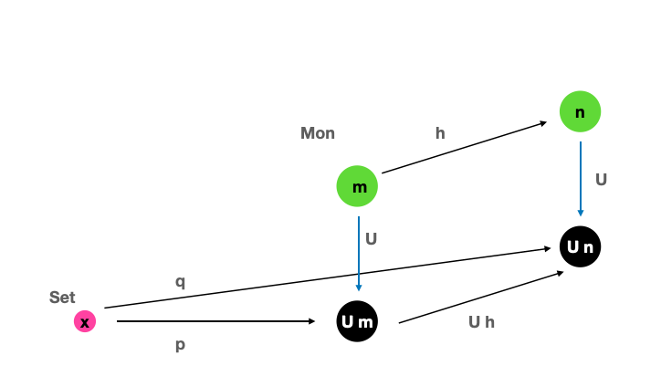

## 13. Free Monoids

모노이드는 카테고리와 프로그래밍에서 매우 중요한 컨셉입니다. 카테고리는 스트롱 타입 언어에, 모노이드는 untyped 언어에 대응됩니다. 모노이드에서는 어느 두 화살표도 합성할 수 있고 이는 untyped 언어에서 아무 함수나 합성하는것과 비슷하기때문입니다(이경우 물론 런타임 에러가 발생합니다.)

모노이드는 대상이 하나인 카테고리로 일전에 묘사했었습니다. 여기서 모든 논리는 사상의 합성 규칙으로 엔코딩 됩니다. 두개의 원소를 "곱"하여 세번째 원소를 만들어내는 전통적인 집합 이론에서의 모노이드와 카테고리적 모델은 완전히 상응합니다. 이 "곱하기" 프로세스는 먼저 쌍을 골라내는것과 이 쌍이 존재하는(product)지 식별하는 것 입니다.

그러면 곱셈의 두번째 부분인 기존 원소와 쌍을 식별하는것을 생략하면 어떻게 됩니까? 임의의 집합을 이용하여 먼저 예를들어봅시다. 이 집합에서 가능한 모든 원소 쌍을 생성하고 이를 새 원소라 부를 수 있습니다. 그리고 이를 영원히 반복 할 수 있습니다. 무한한 집합인 결과는 거의 모노이드와 같습니다. 하지만 모노이드는 단위원소와 결합법칙이 존재하여야합니다. 단순히 이를 만족시키기 위하여 특별한 단위 원소를 추가하고 일부 쌍을 식별하여 봅시다.

두개의 원소를 지니는 집합 { a, b}로 예를 들어보겠습니다. 그것들을 free monoid generators라 부를것입니다. 첫번째로 유닛 역할을 하는 특별한 원소 e를 추가합니다. 그리고 모든 원소 쌍을 추가하고 이를 "product"라 부릅니다. a, b의 product은 쌍 (a, b) 이고 b, a의 product은 쌍 (b, a) 입니다. 비슷하게 a, a의 product은 (a, a) b, b의 product은 (b, b) 입니다. 물론 (a, e), (b, e)와 같은 쌍을 만들 수 있지만 이는 a, b로 식별됩니다. 결론적으로 이번단계에서는 (a, a), (b, b), (a, b), (b, a)원소가 추가되었고 결과 집합은 다음과 같습니다. {e, a, b, (a, a), (b, b), (a, b), (b, a)}

다음단계에서는 (a, (a, b)), ((a, b), a)와 같은 원소들을 추가할것입니다. 여기서 결합법칙은 유지되어야하기 때문에 둘은 식별되어여하고 내부 괄호가 필요합니다.

이런 단계를 반복하며 최종 결과가 무엇인지 예상할 수 있을것입니다. 최종 결과는 a, b로 만들어낼 수 있는 모든 원소를 지니는 리스트일것입니다. 사실 e를 빈 리스트로 나태낸다면 "곱셈"은 단지 리스트 concatenation이라 볼 수 있습니다.

가능한 모든 종류의 엘리먼트 조합을 만들어내고 최소한의 식별을 수행하는 - 법칙을 만족하기 위한 - 이와같은 종류의 construction을 free construction이라 불립니다. 우리는 방금 {a, b} 제너레이트의 집합에 자유 모노이드를 생성한것 입니다.


###  13.1 Free Monoid in Haskell

하스켈에서 원소가 두개인 집합은 Bool 타입과 상응됩니다. 그리고 이 타입에 의해 성성되는 자유 모노이드의 타입은 [Bool] 입니다.

하스켈에서 모노이드는 타입클래스로 다음과 같이 정의됩니다.

```haskell
class Monoid m where
	mempty :: m
	mappend :: m -> m -> m
```

위는 모든 모노이드는 mempty라 불리는 중성 원소 mappend라 불리는 바이너리 함수(곱셈)가 있어야함을 뜻합니다. 유닛과 결합법칙은 하스켈에서 표현할 수 없기에 모노이드를 구체화할때 프로그래머가 이를 증명해야합니다.

사실 모든 타입의 리스트가 모노이드를 형성한다는 것은 아래의 인스턴스 정의에 의해 묘사됩니다.

```haskell
instance Monoid [a] where
	mempty = []		-- unit element
	mappend = (++) -- binary operation
```

우리가 살펴본것처럼 타입 a의 리스트는 제너레이터 집합 a의  자유 모노이드와 같습니다. 정수 집합과 곱셈은 자유 모노이드가 아닙니다. 다음과 같이 많은 product를 식별할 수 있기 때문입니다.

```haskell
2 * 3 = 6
[2] ++ [3] = [2, 3] -- not the same as [6]
```

대상의 내부를 들여다보지 않는 카테고리 이론에서 free construction을 어떻게 수행할 수 있을까요? 여기서 우리의 주력인 unversal construction을 사용할 것 입니다.

두번째 흥미로운 질문은 최소 원소의 수보다 더 많은 원소를 식별하여 일부 자유 모노이드에서 모노이드를 얻을 수 있음을 얻을 수 있다는 것 입니다. 이를 unversial construction에 의해 자연스럽게 따른다는것을 보일것 입니다.

### 13.2  Free Monoid Universal Construction

이전에 universal construction을 경험한것을 떠올려보면 이것은 주어진 패턴을 만족하는 최상의 대상을 선택하는 것 이라는점이라는 것을 알 수 있습니다. 그렇기에 자유 모노이드 "construct"에 universal construction을 적용시키려면 모든 모노이드에서 선택할 대상을 고려해야 합니다. 선택가능한 모든 모노이드의 카테고리가 필요합니다. 근데 모노이드는 카테고리를 형성합니까?

모노이드를 유닛과 곱셈이 있는 특별한 구조의 집합으로 봅시다. 여기서 모노이드적 구조를 유지하는 함수를 사상으로 고를것입니다. 이와같이 구조를 유지하는 함수는 준동형사상(homomorphisms)이라 불립니다. 모노이드적 준동형사상은 두 원소의 쌍을 매핑된 두 원소의 쌍으로 매핑해야합니다.

```haskell
h ( a * b) = h a * h b
```

또 유닛은 유닛으로 매핑해야 합니다.

예를들어 정수 리스트를 정수로 매핑하는 준동형 사상을 생각해봅시다. [2]를 2로, [3]을 3으로 매핑한다면 [2, 3]은 concatenation에 의하여 6으로 매핑됩니다.

```haskell
[2] ++ [3] = [2, 3]
-- becomes multiplication
2 * 3 = 6
```

이제 각각의 모노이드의 내부 구조는 잊어버리고 사상에 해당하는 대상으로 봅시다. 모노이드의 카테고리 Mon을 얻습니다.

내부구조를 잊기전에 중요한 속성에 집중해봅시다. Mon의 모든 대상들은 집합으로 매핑될 수 있습니다. 이들은 단순하게 원소들의 집합입니다. 이 집합은 내재하는(underlying) 집합이라 불립니다. 사실 Mon의 원소들을 집합으로 매핑할수도 있지만 Mon의 사상(준동형사상) 또한 함수로 매핑할 수 있습니다. 이는 사소해보이지만 매우 유용하다는것을 곧 보게될것 입니다. Mon에서 Set으로의 대상, 사상 매핑은 사실상 펑터입니다. 이 펑터는 집합으로 매핑되었을때 유닛엘리먼트가 구분되지 않고 multiplication에 대한 정보도 사라져 모노이드적 구조를 잊어버리기 때문에 망각함자(forgetful functor)라 불립니다. 망각 펑터는 카테고리 이론에서 정기적으로 등장합니다.

이제 Mon에 대한 두가지 다른 관점이 있습니다.  Mon을 다른 카테고리와 마찬가지로 대상과 사상이 있는 카테고리로 간주할 수 있습니다. 이 관점에서 모노이드의 내부 구조를 들여다 보지는 않습니다. Mon의 특정 대상에대하여 우리가 말할수 있는것은 이것은 스스로 연결되어있고 사상을 통해 다른 대상과 연결된다는 점 입니다. 사상의 "multiplication" 테이블(합성규칙)은 다른 관점에서 유래됩니다: 모노이드를 집합으로 보는 관점. 범주이론으로 이동하며 이 정보는 완전히 손실되지 않습니다. 망각함자를 이용하여 이 정보에 접근할 수 있습니다.

universal construction을 적용하기 위하여 모노이드의 카테고리를 탐색하고 자유 모노이드의 최상의 후보를 선택하기 위한 특별한 속성이 필요로 합니다. 하지만 자유 모노이드는 그것의 제너레이터에 의해 정의되어있습니다. 다른 종류의 제너레이터를 선택하면 다른 종류의 자유 모노이드가 만들어집니다. construction은 제너레이터의 집합에서 시작해야합니다. 그렇기에 다시 집합으로 돌아가 봅시다.

이제 망각함자가 필요한 순간입니다. 이것을 모노이드의 x-ray 이미지로 이용할 수 있습니다. 엑스레이 이미지를 이용하여 제너레이터를 식별할 수 있습니다.

제너레이터의 집합 x에서 시작합시다. 이는 Set에 속합니다.

적용하려는 패턴은 Mon의 대상 모노이드 m, Set의 함수 p, 그리고 U는 Mon -> Set인 망각함자입니다.

```haskell
p :: x -> U m
```

이는 매우 이질적인 패턴입니다 - 반은 Mon에 나머지 반은 Set에 있음

이 아이디어에서 함수 p는 m의 엑스레이 이미지 내부에서 제너레이터 집합을 식별합니다. 함수다 식별을 어느정도 잘하는지는 상관이 없습니다.(축소할수도 있습니다.) 이 패턴을 가장 잘 나타내는것을 선택하는 universal construction에 의하여 모두 분류됩니다.


후보 가운데 랭킹또한 적용해야 합니다. 다음과 같이 다른 후보가 있다 가정해봅시다

```haskell
q :: x -> U n
```

만일 다음과 같은 사상이 있다면(준동형 사상) m이 n보다 낫다고 할 수 있을겁니다.

```haskell
h :: m -> n

q = U h . p
-- q는 p와 U h로 분해됨
```



p가 m에서 제너레이터를 선택하는것으로, q는 동일한 제너레이터를 선택하는것으로 생각한다면 h는 두 모노이드간에 이 제너레이터를 매핑하는것으로 생각할 수 있습니다. 모노이드적 구조를 보존한다는 h의 정의를 기억하세요. 이는 하나의 모노이드 구조에 대한 두 제너레이터 product는 두번째 모노이드에 대한 두 제너레이터의 product로 매핑한다는 것을 뜻합니다.


이 랭킹은 최적의 후보를 찾기위해 사용됩니다. 아래는 자유 모노이드의 정의입니다.

> We’ll say that 𝑚 (together with the function 𝑝) is the free monoid with the generators 𝑥 if and only if there is a unique morphism h from 𝑚 to any other monoid 𝑛 (together with the function 𝑞) that satisfies the above factorization property.

부수적으로 이는 두번째 질문또한 답합니다. Uh 함수는 다수의 Um 원소를 하나의 원소 Un로 축소(collapse)할 수 있는 힘이 있습니다. 이 축소는 자유 모노이드에서 특정 원소를 식별하는것과 대응됩니다. 그리므로 제너레이터가 있는 어느 모노이드 x는 일부 요소를 식별하여 x 기반의 자유 모노이드에서 얻을 수 있습니다. 자유 모노이드는 최소한의 식별만 이루어진 것 입니다.

수반(adjunctions)에 대하여 이야기한 이후 자유 모노이드로 다시 돌아올 것 입니다.