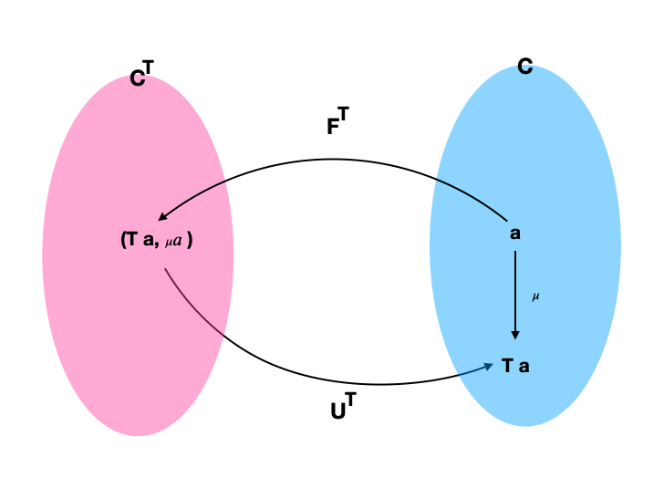
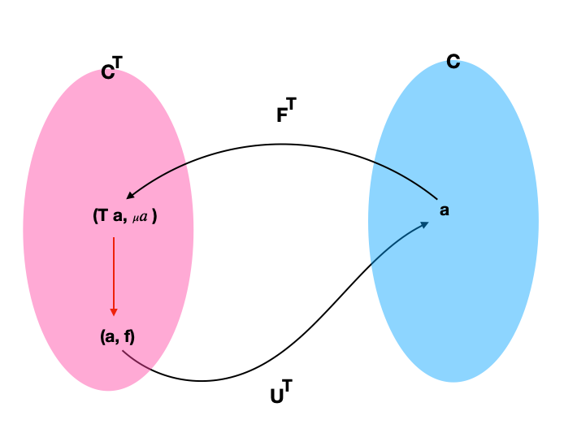

## 25. Algebras for Monads


만일 엔도펑터를 수식을 정의하는것으로 해석한다면 algebra는 이를 evaluate할 수 있게 하고 모나드는 그것들을 형성하고 조작하도록 합니다. algebra와 모나드를 결합함으로써 많은 기능을 얻을 수 있음은 물론 여러개지 흥미로운 질문에 답할 수 있습니다.

이중 하나는 모나드와 수반 간의 관계 입니다. 일전에 보았듯이 모든 수반은 모나드를 정의합니다.(그리고 코모나드도) 질문: 그럼 모든 모나드(코모나드)가 수반에서 파생될 수 있습니까? 이 대답은 긍정적 입니다.(The answer is positive. ) 주어진 모나드를 생성하는 모든 수반 패밀리가 있습니다. 이 두가지 수반을 나중에 보게될 것 입니다.

정의를 리뷰해보죠. 모나드는 일부 일관성 조건을 만족시키는 두개의 자연변환이 있는 엔도펑터 m 입니다. a에 대한 이 자연변환의 컴포넌트는 다음과 같습니다.

> 𝜂𝑎 ∷𝑎→𝑚𝑎
>
> 𝜇𝑎 ∷𝑚(𝑚𝑎)→𝑚𝑎

동일한 엔도펑터에 대한 algebra는 사상과 함께 특정한 대상 - 캐리어 a - 을 선택하는 것 입니다.

> alg :: m a -> a

제일먼저 눈에 띄는 부분은 alg의 방향이 𝜂𝑎와 반대라는 것 입니다. 𝜂𝑎의 의미는 타입 a에 대하여 어떠한 표현을 생성해낸다는 것 입니다. 첫번째 일관성 조건은 algebra와 모나드가 호환하게합니다. 모나드를 동일한 캐리어 타입 a 를 지니는 algebra로 evaluate하면 원래의 값이 나옵니다.

> 𝑎𝑙𝑔 ∘ 𝜂𝑎 = id𝑎

두번째 조건은 두번 감싸진 표현 m (m a)를 evaluate할 수 있는 방법이 두가지가 있음을 보입니다. 이를 flat하게 만들기 위해 먼저 𝜇𝑎를 적용하고 algebra를 이용하여 evaluate 하거나, 표현의 감싸진 내부를 evaluate하기 위하여 algebra를 리프팅 할 수 있습니다. 그리고난 이후에 결과를 다시 evaluate하는 것 입니다. 두 방식은 동등해야 합니다.

> 𝑎𝑙𝑔∘𝜇𝑎 =𝑎𝑙𝑔∘𝑚𝑎𝑙𝑔

여기서 m alg는 펑터 m으로 alg에서 리프팅한 사상입니다. 아래의 가환 다이어그램은 두 조건을 보입니다.(m을 T로 바꾸어 표현했습니다.)

 

물론 하스켈에서 이를 표현할 수 있습니다.

```haskell
alg . return = id
alg . join  = alg . fmap alg
```

간단한 예를 들어보죠. a 타입으로 이루어진 리스트와 a의 리스트에서 a를 만들어내는 함수를 만들어내는 리스트 엔도펑터를 위한 algebra를 생각해봅시다. 이 함수를 엘리먼트 타입과 accumulator 타입이 모두 a인 foldr로 나타낼 수 있습니다:

```haskell
foldr :: (a -> a -> a) -> a -> [a] -> a
```

이 특별한 algebra는 두개의 인수 함수로 지정됩니다. 이를 f, 값 타입을 z라 부릅시다. 이 리스트 펑터는 값을 싱글톤 리스트로 만드는 모나드 이기도 합니다. 여기서 algebra의 합성, return x이후 foldr f z의 합성은 다음과 같습니다.

```haskell
foldr f z [x] = x `f` z
```

f는 중위연산자 입니다. 모든 x에 대하여 다음의 동일 조건이 만족한다면 이 algebra는 모나드와 호환됩니다.

```haskell
x `f` z = x
```

f를 이항 연산자로 본다면 조건을통해 z가 right unit임을 알 수 있습니다.

두번째 조건은 리스트의 리스트에 동작합니다. join은 각각의 리스트를 중첩시킬것이고 결과 리스트를 fold할 수 있습니다. 반대로 먼저 각각의 리스트를 fold하고 결과 리스트를 fold할 수 있습니다. 반복해서 f를 이항연산자로 해석한다면 이 조건을 통해 이항연산자가 결합법칙을 만족한다는 것을 알 수 있습니다. 이 조건들은 (a, f, z)가 모노이드일때 확실히 충족합니다.


### 25.1 T-algebras

수학자들은 모나드를 T로 부르는것을 선호하기 때문에 이와 호환되는 algebra를 T-algebra로 부릅니다. 카테고리 C에 있는 모나드 T에 대하여 주어진 T-algebra는 Eilenberg-Moore 카테고리라 불리는 카테고리를 형성하고 이를 C^T라 부릅니다. 이 카테고리의 사상은 algebra의 homomorphism 입니다.(F-algebra를 정의할때 보았었던)

T-algebra는 캐리어 대상과 evaluator 쌍으로 이루어져 있습니다.(a, f) 여기에는 분명히 C^T 에서 C로 가는 망각함자 U^T가 존재하고 이는 (a, f)를 a로 매핑합니다. 또한 이는 T-algebra의 homomorphism을 C의 대상간 해당하는 사상으로 매핑합니다. 수반을 이야기할때 망각 함자에 대한 left adjoint는 free functor라 불리는것을 기억할것입니다.

U^T에 대한 left adjoint는 F^T라 불립니다. 이는 C의 대상 a를 C^T에 속한 free algebra로 매핑합니다. 이 free algebra의 캐리어는 T a 입니다. 그리고 evaluator는 T (T a) -> T a로 돌아가는 사상입니다. T가 모나드 이기 때문에 𝜇𝑎(join)을 evaluator로 사용할 수 있습니다.

이것이 T-algebra임을 보여야 합니다. 그러기 위해 아래의 두가지 일관성(coherence) 조건이 만족함을 보여야 합니다.

> 𝑎𝑙𝑔∘𝜂𝑇𝑎 =id𝑇𝑎
>  𝑎𝑙𝑔 ∘ 𝜇𝑎 = 𝑎𝑙𝑔 ∘ 𝑇 𝑎𝑙𝑔

𝜇를 algebra에 이용한다면 이든 단순하게 모나드 법칙 입니다.

모든 수반이 모나드를 정의한다는 것을 기억하세요. F^T와 U^T사이의 수반이 Eilenberg-Moore 카테고리를 만들때 쓰이는 모나드 T를 정의한다는 것을 알 수 있습니다. 그렇기에 모든 모나드는 수반에 의해 만들어질 수 있다 결론내릴 수 있습니다. 추후에 동일한 모나드를 만들어내는 다른 수반을 소개할것입니다.

계획입니다: 첫번쨰로 F^T가 참으로 U^T의 left adjoint 인지를 보일것 입니다. 이를 위하여 수반의 unit과 counit을 정의할것이고 이는 대응되는 triangular identities가 만족됨을 보일것 입니다(~~𝑎𝑙𝑔∘𝜂𝑇𝑎 =id𝑇𝑎~~). 그리고 난 이후에 이 수반으로 만들어지는 모나드가 참으로 원래의 모나드와 동일한지 보일것 입니다.

수반의 unit은 자연변환 입니다.

> 𝜂∷𝐼 →𝑈𝑇 ∘𝐹𝑇

이 자연변환의 컴포넌트 a에 대하여 생각해 봅시다. Identity functor는 a를 제공합니다. free functor는 free algebra를 만들어 냅니다.(𝑇 𝑎,𝜇𝑎) 그리고 forgetful functor는 이를 T a 로 줄입니다. a 에서 T a로 향하는 매핑을 얻었지만 모나드 T의 unit을 단순하게 수반의 unit으로 이용할것입니다.



counit을 보죠:

> 𝜀∷𝐹𝑇 ∘𝑈𝑇 →𝐼

이의 컴포넌트 T-algebra (a, f)에 대하여 생각해보죠. forgetful functor 는 f를 망각합니다. 그리고 free functor는 (T a, 𝜇𝑎) 쌍을 만들어 냅니다. (a, f) counit 𝜀에 대한 컴포넌트를 정의하기 위하여 Eilenberg-Moore 카테고리의 우측 사상이 혹은 T-algebra의 homomorphism이 필요합니다.

> (𝑇 𝑎,𝜇𝑎) → (𝑎,𝑓)



이 homomorphism은 캐리어 T a 를 a 로 매핑해야 합니다. 잊고있었던 evaluator f를 다시 생각해보죠. 이번에는 T-algebra의 homomorphism적인 측면을 이용할것입니다. 실제로 f가 만드는 T-algebra와 동일한 가환 다이어그램이 T-algebra의 homomorphism으로 해석될 수 있습니다.


(a, f)에 대한(T-algebra 카테고리의 대상) 코유닛 자연변환 𝜀가 f가 됨을 정의하였습니다.

수반을 완성하기 위하여 unit과 counit이 triangular identities를 만족함을 보여야 합니다.


첫번째는 모나드 T의 단위법칙으로 유지됩니다. 두번째는 단순한 T-algebra (a, f) 입니다.

두 펑터가 수반을 이룸을 보였습니다.

> 𝐹^𝑇 ⊣𝑈^𝑇

모든 수반은 모나드를 수반합니다. 아래의 왕복운동은

> 𝑈𝑇 ∘𝐹𝑇

해당 모나드를 발생시키는 C의 엔도펑터 입니다. 이것이 대상 a에 적용했을때 어떤 역할을 하는지 보죠. F^T는 free algebra (T a, 𝜇𝑎)를 만들어 냅니다. forgetful functor U^T는 evaluator를 드랍시킵니다. 그렇기에 아래의 공식이 성립합니다.

> U^T . F^T = T

예상했던바와 같이 수반의 unit은 모나드 T의 unit 입니다. 

수반의 counit이 아래의 공식을 통하여 monadic multiplication을 만들어 냄을 기억하세요.

> 𝜇=𝑅∘𝜀∘𝐿

이는 3가지 자연변환의 수평적 합성 입니다. 그들 중 두개는 각각 L에서 L으로, R에서 R으로 매핑되는 identity 자연변환 입니다. 가운데에 있는 counit은 algebra (a, f)에 대한 컴포넌트가 f인 자연변환 입니다.

𝜇𝑎의 컴포넌트를 생각해보죠. 우선 F^T 다음에 𝜀를 합성합니다. 그리고 결과물은 𝜀 . F^T애 대한 a 컴포넌트 입니다. F^T는 a를 취하여 (T a, 𝜇𝑎)를 만들고 𝜀는 evaluator를 선택하기 때문에 최종적으로 𝜇𝑎로 끝나게 됩니다. 좌측에 U^T와 수평적 합성은 아무것도 바꾸지 않습니다. 사상에 대한 U^T의 동작은 뻔하기 때문이죠. 그렇기에 수반을 통해 얻어진 𝜇는 본래의 모나드 T의 𝜇와 동일합니다.


### 25.2 The kleisli Category

클라이슬리 카테고리는 예전에 많이 봤습니다. 이는 다른 카테고리 C와 모나드 T로 만들어 집니다. 이를 𝐂_𝑇 로 부릅시다. 𝐂_𝑇의 대상은 C의 대상과 동일합니다. 하지만 사상은 다릅니다. 사상 a에서 b로 가는 클라이슬리 카테고리의 사상 fk는 본래 카테고리에서 a에서 b로 가는 사상 f에 대응됩니다. 이 fk를 a에서 b로 가는 클라이슬리 화살표라 부릅니다.

클라이슬리 카테고리에서 사상의 합성은 클라이슬리 화살표의 모나드적 합성적 측면으로 정의됩니다. 예를들어 fk이후에 gk를 합성하는 것을 보죠.

> fk :: a -> b
>
> gk :: b -> c

이는 본래 카테고리에서 다음과 같습니다.

> f :: a- > T b
>
> g :: b -> T c

본래의 카테고리에서 클라이슬리 화살표로 이루어진 합성은 다음과 같습니다.

> hk = gk . fk
>
> h :: a -> T c
>
> h = 𝜇 ∘ (𝑇 𝑔) ∘ 𝑓

하스켈에서는 다음과 같이 씁니다.

```haskell
h = join . (fmap g) . f
```

이는 𝐂에서 𝐂_𝑇 로 가는 펑터 입니다.  대상에게는 별 특징이 없고 사상의 경우 C의 사상 f를 f의 리턴타입을 장식하며 클라이슬리 화살표를 만들어 𝐂_𝑇의 사상으로 매핑합니다.

> // 주어진 사상 f
>
> f :: a -> b
>
> // 이와 대응되는 𝐂𝑇의 사상
>
> 𝜂∘𝑓

하스켈에서 이는 다음과 같습니다.

```haskell
return . f
```

또한 𝐂_𝑇 에서 다시 𝐂로 돌아오는 펑터 G를 정의할 수 있습니다. 이는 클라이슬리 카테고리에서 대상 a를 취하여 본래의 카테고리 C의 대상 T a 로 매핑합니다. 클라이슬리 화살표에 해당하는 fk 사상에 대한 동작:

> f :: a -> T b
>
> // is a morphism in C:
>
> T a -> T b
>
> // given by first lifting f and then applying 𝜇

하스켈을 이용한 노테이션은 다음과 같습니다.

```haskell
GfT =join.fmapf
```

이를 join에 대한 모나딕 바인드로 정의됨을 알아차릴 수 있습니다.

이 두 펑터가 수반을 이루는것을 보이는 것은 쉽습니다.

> 𝐹⊣𝐺

그리고 이들의 합성 𝐺 ∘ 𝐹은 본래의 모나드 T가 됩니다.

그렇기에 이는 동일한 모나드를 만들어내는 두번째 수반이 됩니다. 실제로 C에 동일한 모나드 T를 생성하는 모든 수반들의 카테고리 Adj(C, T)가 존재합니다. 방금 보았던 클라이슬리 수반(Kleisli adjunction)은 이 카테고리의 initial object 이고 Eilenberg-Moore adjunction은 terminal object 입니다.


### 25.3 Coalgebras for Comonads

비슷한 구조가 어떤 코모나드 W에 대해서도 가능합니다. 코모나드와 호환되는 coalgebra를 정의할 수 있습니다. 이들은 아래의 다이어그램을 가환하게합니다.


여기서 coa는 캐리어 타입이 a인 coalgebra의 coevaluation 사상입니다.

> coa :: a -> W a

그리고 𝜀와 𝛿는 코모나드를 정의하는 두 자연변환 입니다.(하스켈에서 이들의 컴포넌트는 extract, duplicate)

이 coalgebra 카테고리에서 C로 매핑하는 forgetful functor U^W가 당연히 존재합니다. 이는 단순히 coevaluation을 망각합니다. 이의 right adjoint F^W을 곧 고려할 것 입니다.

> 𝑈𝑊 ⊣𝐹𝑊

이 망각 함자에 대한 right adjoint는 cofree functor F^W로 불리고 cofree algebra를 만들어 냅니다. C의 대상 a에 coalgebra (W a, 𝛿𝑎)를 할당합니다. 𝑈^𝑊 ∘𝐹^𝑊 합성을 통하여 수반은 본래의 코모나드를 만들어 냅니다.

비슷하게 co-클라이슬리 화살표와 대응되는 수반으로 코모나드를 다시 만들어내는것과 함께 co-클라이슬리 카테고리를 정의할 수 있습니다.


### 25.4 Lenses

lense에 대한 이야기로 돌아가보죠. 렌즈는 다음과같은 coalgebra로 쓰여질 수 있습니다.

> coalgs :: a -> Store s a

For the functor Store s:

```haskell
data Store s a = Store (s -> a) a
```

이 coalgebra는 다음의 두 함수 쌍으로 표현될 수 있습니다.

> Set :: a -> s -> a
>
> get :: a -> s

(a가 모든것 "all"을 나태내고 s는 이의 일부 "small"을 나타낸다고 생각하세요) 이 함수 쌍을 이용해 다음과 같이 나타낼 수 있습니다.

> coals a = Store (set a) (get a)

여기서 a는 타입 a의 값입니다. 일부 적용된 set이 s -> a 함수라는 것에 주목하세요.

Store는 코모나드 입니다.

```haskell
instance Comonad (Store s) where
extract (Store f s) = f s
duplicate (Store f s) = Store (Store f) s
```

질문은 다음과 같습니다: 코모나드를 위한 coalgebra의 어떤 조건이 렌즈입니끼?(Under what conditions is a lens a coalgebra for this comonad?) 첫번째 coherence 조건은 다음과 같습니다.

> 𝜀𝑎 ∘ 𝑐𝑜𝑎𝑙𝑔 = id𝑎
>
> // 해석하면
>
> set a (get a) = a

이는 구조 a의 필드를 이전값으로 설정하면 아무것도 변하지 않는다는 사실을 표현하는 렌즈의 법칙 입니다.

두번째 조건은 다음과 같습니다

> 𝑓 𝑚𝑎𝑝 𝑐𝑜𝑎𝑙𝑔 ∘ 𝑐𝑜𝑎𝑙𝑔 = 𝛿𝑎 ∘ 𝑐𝑜𝑎𝑙𝑔

이를 해석하기 위해 조금 복잡해 집니다. 첫째로 Store 펑터의 fmap 정의를 기억해봅시다.

```haskell
fmap g (Store f s) = Store (g . f) s
```

coalg의 결과에 fmap coalg를 적용하면 다음을 얻습니다.

```haskell
Store (coalg . set a) (get a)
```

반대로 coalg의 결과에 duplicate를 적용하면 다음을 얻습니다.

```haskell
Store (Store (set a)) (get a)
```

이 두 수식이 동일하기 위하여 임의의 s에 대하여 동작하는 Store내부의 두 함수는 같아야 합니다.

```haskell
coalg (set a s) = Store (set a) s
-- coalg을 확장하면
Store (set (set a s)) (get (set a s)) = Store (set a) s
```

이는 남아있는 두개의 렌즈 법칙과 동등합니다. 첫째로:

```haskell
set (set a s) = set a
```

이는 값을 두번 할당하는것은 한번 하는것과 동일함을 보입니다. 두번쨰로는:

```haskell
get (set a s) = s
```

s로 설정된 필드값을 가져오면 s가 반환됨을 보입니다.

다시말해서 잘 동작하는 렌즈는 Store 펑터에 대한 comonad coalgebra이라 할 수 있습니다.

